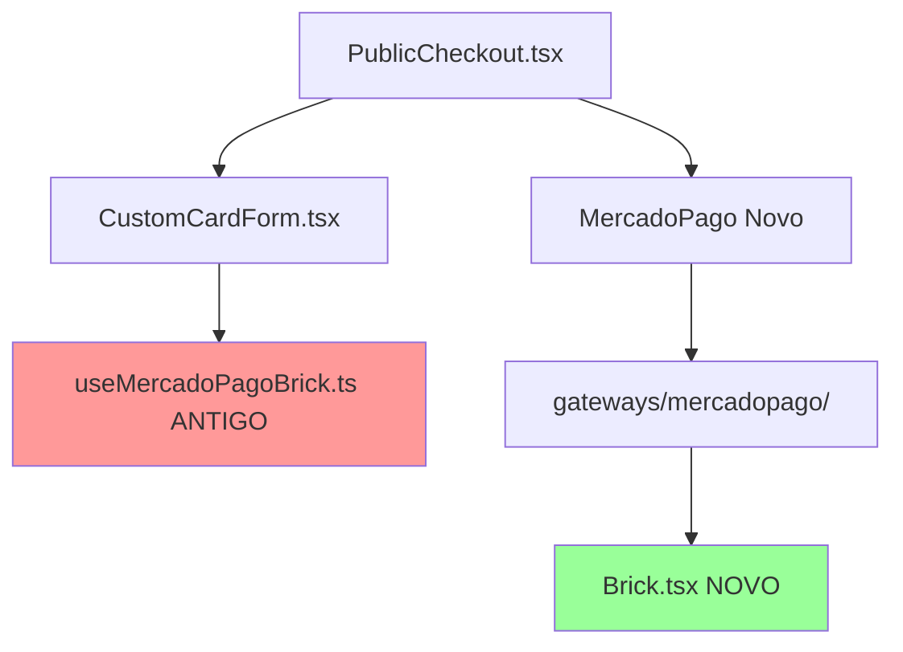

# Análise de Migração - Mercado Pago

**Data:** 29 de Novembro de 2025
**Status:** ⚠️ Migração Parcial Detectada

## 🔍 Problema Identificado

A migração do Mercado Pago para a arquitetura modular está **incompleta**. Há uma mistura de código novo e antigo sendo usado simultaneamente.

## 📊 Estado Atual

### ✅ Código Novo (Em Uso)

**Localização:** `src/integrations/gateways/mercadopago/`

**Usado por:**
- `src/pages/PublicCheckout.tsx` (linha 41)
  ```typescript
  import * as MercadoPago from "@/integrations/gateways/mercadopago";
  ```

**Arquivos do Módulo:**
- ✅ `index.ts` - Barrel export
- ✅ `types.ts` - Interfaces
- ✅ `api.ts` - Funções de API
- ✅ `hooks.ts` - React hooks
- ✅ `Brick.tsx` - Componente do formulário
- ✅ `README.md` - Documentação

### ❌ Código Antigo (Ainda em Uso)

**Localização:** `src/hooks/useMercadoPagoBrick.ts`

**Usado por:**
- `src/components/payment/CustomCardForm.tsx` (linha 4)
  ```typescript
  import { useMercadoPagoBrick } from "@/hooks/useMercadoPagoBrick";
  ```

## 🔗 Dependências



## 🎯 Análise de Impacto

### CustomCardForm.tsx

**Função:** Renderiza o formulário de cartão de crédito usando o SDK do Mercado Pago.

**Problema:** Usa o hook antigo `useMercadoPagoBrick` ao invés do novo componente `Brick.tsx`.

**Complexidade:** 
- ~200 linhas de código
- Lógica complexa de validação
- Integração com SDK do Mercado Pago (iframes)
- Polling de foco para detectar campos ativos

### useMercadoPagoBrick.ts

**Função:** Hook que encapsula a inicialização e interação com o SDK do Mercado Pago.

**Problema:** Código complexo e com "gambiarras" (conforme análise prévia):
- Polling de foco a cada 200ms
- Workarounds para problemas do SDK
- Lógica de stale closures

**Linhas de Código:** ~200 linhas

## 🛠️ Opções de Migração

### Opção 1: Migração Completa (Recomendada)

**Ação:** Substituir `CustomCardForm.tsx` para usar `Brick.tsx` do novo módulo.

**Vantagens:**
- ✅ Código limpo e modular
- ✅ Remove gambiarras
- ✅ Usa componente já documentado
- ✅ Consistência com a arquitetura nova

**Desvantagens:**
- ⚠️ Requer reescrita do `CustomCardForm.tsx`
- ⚠️ Pode quebrar fluxo existente se não for bem testado

**Esforço:** Médio (2-3 horas)

**Passos:**
1. Analisar como `CustomCardForm.tsx` é usado
2. Verificar se `Brick.tsx` novo tem todas as features necessárias
3. Reescrever `CustomCardForm.tsx` para usar `<MercadoPago.Brick />`
4. Testar fluxo completo de pagamento
5. Remover `useMercadoPagoBrick.ts`

### Opção 2: Migração Incremental

**Ação:** Mover `useMercadoPagoBrick.ts` para dentro do módulo novo.

**Vantagens:**
- ✅ Menos disruptivo
- ✅ Mantém código funcionando
- ✅ Organiza arquitetura

**Desvantagens:**
- ❌ Mantém código complexo
- ❌ Não remove gambiarras
- ❌ Duplicação de lógica (Brick.tsx vs useMercadoPagoBrick)

**Esforço:** Baixo (30 minutos)

**Passos:**
1. Mover `useMercadoPagoBrick.ts` para `gateways/mercadopago/hooks.ts`
2. Atualizar import em `CustomCardForm.tsx`
3. Exportar no `index.ts`

### Opção 3: Manter Dual (Não Recomendada)

**Ação:** Manter ambos os códigos coexistindo.

**Vantagens:**
- ✅ Zero esforço

**Desvantagens:**
- ❌ Código duplicado
- ❌ Confusão para manutenção
- ❌ Inconsistência arquitetural

## 📋 Recomendação

**Opção 1 - Migração Completa** é a melhor escolha a longo prazo.

### Justificativa:

1. **Qualidade de Código:** Remove as gambiarras identificadas na análise prévia
2. **Manutenibilidade:** Um único componente de formulário, bem documentado
3. **Consistência:** Alinha com a arquitetura modular já implementada no tracking
4. **Futuro:** Facilita futuras melhorias e debugging

### Plano de Ação:

#### Fase 1: Análise (30 min)
- [ ] Verificar todas as props e callbacks de `CustomCardForm.tsx`
- [ ] Comparar com interface de `Brick.tsx`
- [ ] Identificar gaps de funcionalidade

#### Fase 2: Implementação (1-2h)
- [ ] Reescrever `CustomCardForm.tsx` usando `<MercadoPago.Brick />`
- [ ] Adicionar features faltantes em `Brick.tsx` se necessário
- [ ] Atualizar validações e tratamento de erros

#### Fase 3: Testes (1h)
- [ ] Testar fluxo completo de pagamento com cartão
- [ ] Testar validações de campos
- [ ] Testar cálculo de parcelas
- [ ] Testar erros e edge cases

#### Fase 4: Limpeza (15 min)
- [ ] Remover `src/hooks/useMercadoPagoBrick.ts`
- [ ] Remover backups (`.backup`, `.bak`)
- [ ] Atualizar documentação

## 🚨 Riscos

| Risco | Probabilidade | Impacto | Mitigação |
|:---|:---:|:---:|:---|
| Quebrar fluxo de pagamento | Média | Alto | Testes extensivos antes de deploy |
| Perder funcionalidades | Baixa | Médio | Análise detalhada de features |
| Bugs em produção | Baixa | Alto | Deploy gradual + rollback plan |

## 📝 Notas

- O `Brick.tsx` novo já está bem documentado no README
- A análise prévia já identificou os problemas do código antigo
- A migração de tracking foi bem-sucedida, servindo como template
- É melhor fazer isso agora do que acumular dívida técnica

## 🎯 Próximo Passo

Aguardar decisão sobre qual opção seguir antes de prosseguir com PushinPay.
