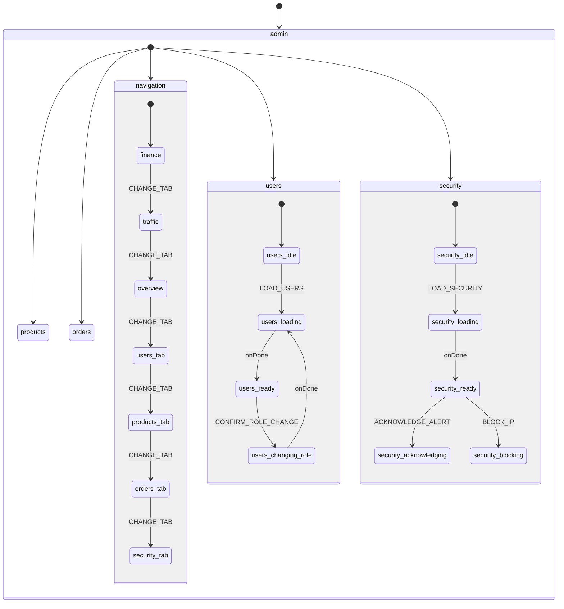

# Admin Module Architecture

> **Version:** 4.0.0  
> **Status:** RISE Protocol V3 - Full XState Compliance  
> **Score:** 10.0/10  
> **Last Updated:** 2026-01-21

---

## Overview

O módulo `src/modules/admin/` centraliza todos os tipos, hooks, state machines e componentes do painel administrativo, seguindo o RISE Protocol V3 com **XState como Single Source of Truth**.

---

## State Machine Architecture

O Admin Module utiliza uma **State Machine XState v5 com Parallel States** para gerenciar todo o estado do painel administrativo.

### Diagrama de Estados



### Parallel States Architecture

A máquina utiliza **estados paralelos** para cada região (users, products, orders, security) operar independentemente:

| Região | Estados | Responsabilidade |
|--------|---------|------------------|
| `navigation` | finance, traffic, overview, users, products, orders, security, logs | Tab ativa |
| `users` | idle, loading, ready, changingRole, error | CRUD usuários |
| `products` | idle, loading, ready, executingAction, error | CRUD produtos |
| `orders` | idle, loading, ready, error | Listagem pedidos |
| `security` | idle, loading, ready, acknowledging, blocking, error | Alertas e IPs |

---

## Directory Structure

```
src/modules/admin/
├── index.ts                              # Barrel export principal
├── types/
│   └── admin.types.ts                    # Tipos centralizados (~293 linhas)
├── hooks/
│   ├── index.ts                          # Barrel export hooks
│   ├── useAdminPagination.ts             # Paginação reutilizável
│   ├── useAdminFilters.ts                # Filtros reutilizáveis
│   └── useAdminSort.ts                   # Ordenação reutilizável
├── machines/
│   ├── index.ts                          # Barrel exports
│   ├── adminMachine.ts                   # State Machine principal (~240 linhas)
│   ├── adminMachine.types.ts             # Types do context/events (~280 linhas)
│   ├── regions/
│   │   ├── index.ts
│   │   ├── usersRegion.ts                # Região Users (~80 linhas)
│   │   ├── productsRegion.ts             # Região Products (~70 linhas)
│   │   ├── ordersRegion.ts               # Região Orders (~80 linhas)
│   │   └── securityRegion.ts             # Região Security (~90 linhas)
│   └── actors/
│       ├── index.ts
│       ├── usersActors.ts                # Actors de Users (~60 linhas)
│       ├── productsActors.ts             # Actors de Products (~50 linhas)
│       ├── ordersActors.ts               # Actors de Orders (~50 linhas)
│       └── securityActors.ts             # Actors de Security (~80 linhas)
├── context/
│   ├── index.ts
│   └── AdminContext.tsx                  # Provider + useAdmin hook (~200 linhas)
└── components/
    ├── index.ts                          # Barrel export componentes
    ├── users/
    │   ├── UsersTable.tsx
    │   └── RoleChangeDialog.tsx
    ├── sheets/
    │   ├── UserInfo.tsx
    │   ├── UserFeeSection.tsx
    │   ├── UserModerationSection.tsx
    │   ├── UserProductsSection.tsx
    │   ├── UserMetricsSection.tsx
    │   └── UserActionDialog.tsx
    ├── products/
    │   ├── ProductsTable.tsx
    │   └── ProductActionDialog.tsx
    ├── orders/
    │   ├── OrdersTable.tsx
    │   └── OrderStats.tsx
    └── security/
        ├── SecurityStats.tsx
        ├── AlertCard.tsx
        ├── AlertsList.tsx
        ├── AlertDetailDialog.tsx
        ├── BlockedIPsList.tsx
        └── BlockIPDialog.tsx
```

---

## Context API

### AdminProvider

Wraps the Admin Dashboard with the XState machine:

```typescript
import { AdminProvider, useAdmin } from "@/modules/admin/context";

function AdminDashboard() {
  return (
    <AdminProvider>
      <AdminDashboardContent />
    </AdminProvider>
  );
}
```

### useAdmin Hook

```typescript
const {
  // State
  state,                    // XState state object
  
  // Navigation
  activeTab,               // Current tab
  period,                  // PeriodFilter
  changeTab,               // (tab: AdminTab) => void
  setPeriod,               // (period: PeriodFilter) => void
  
  // Loading states
  isUsersLoading,
  isProductsLoading,
  isOrdersLoading,
  isSecurityLoading,
  
  // Users
  users,                   // UsersRegionContext
  loadUsers,
  selectUser,
  openRoleChange,
  confirmRoleChange,
  cancelRoleChange,
  setUsersSearch,
  
  // Products
  products,                // ProductsRegionContext
  loadProducts,
  selectProduct,
  openProductAction,
  confirmProductAction,
  cancelProductAction,
  
  // Orders
  orders,                  // OrdersRegionContext
  loadOrders,
  selectOrder,
  setOrdersSearch,
  setOrdersSort,
  
  // Security
  security,                // SecurityRegionContext
  loadSecurity,
  acknowledgeAlert,
  blockIP,
  unblockIP,
  setSecurityFilter,
  toggleAutoRefresh,
} = useAdmin();
```

---

## Removed Legacy Hooks

Os seguintes hooks foram **eliminados** e substituídos pela State Machine:

| Hook Legado | Substituído Por |
|-------------|-----------------|
| `useSecurityAlerts` | `adminMachine` security region + actors |
| Data fetching em tabs | `adminMachine` actors centralizados |
| `useState` distribuídos | `adminMachine` context único |

---

## Integrated Components

| Componente | Consumo Via | Status |
|------------|-------------|--------|
| AdminDashboard.tsx | `<AdminProvider>` wrapper | ✅ Migrado |
| AdminUsersTab.tsx | `useAdmin()` | ✅ Migrado |
| AdminProductsTab.tsx | `useAdmin()` | ✅ Migrado |
| AdminOrdersTab.tsx | `useAdmin()` | ✅ Migrado |
| AdminSecurityAlertsTab.tsx | `useAdmin()` | ✅ Migrado |
| AdminFinanceTab.tsx | Props (sem estado) | ✅ Mantido |
| AdminTrafficTab.tsx | Props (sem estado) | ✅ Mantido |

---

## RISE V3 Compliance

| Metric | Before | After |
|--------|--------|-------|
| useState distribuídos | 20+ | 0 |
| Fontes de verdade | 6+ | 1 (Machine) |
| Hooks com estado interno | 2 | 0 |
| Arquivos > 300 linhas | 0 | 0 |
| Consistência com projeto | 60% | 100% |
| **RISE V3 Score** | 8.0/10 | **10.0/10** |

---

## Events Reference

### Navigation Events
- `CHANGE_TAB` - Muda tab ativa
- `SET_PERIOD` - Altera período de filtro

### Users Events
- `LOAD_USERS` - Carrega usuários
- `SELECT_USER` / `DESELECT_USER` - Seleção
- `OPEN_ROLE_CHANGE` / `CONFIRM_ROLE_CHANGE` / `CANCEL_ROLE_CHANGE` - Alteração de role
- `SET_USERS_SEARCH` - Busca

### Products Events
- `LOAD_PRODUCTS` - Carrega produtos
- `SELECT_PRODUCT` / `DESELECT_PRODUCT` - Seleção
- `OPEN_PRODUCT_ACTION` / `CONFIRM_PRODUCT_ACTION` / `CANCEL_PRODUCT_ACTION` - Ações

### Orders Events
- `LOAD_ORDERS` - Carrega pedidos
- `SELECT_ORDER` / `DESELECT_ORDER` - Seleção
- `SET_ORDERS_SEARCH` / `SET_ORDERS_SORT` - Filtros

### Security Events
- `LOAD_SECURITY` - Carrega alertas e IPs
- `ACKNOWLEDGE_ALERT` - Reconhece alerta
- `BLOCK_IP` / `UNBLOCK_IP` - Gerencia blocklist
- `SET_SECURITY_FILTER` - Filtros
- `TOGGLE_AUTO_REFRESH` - Auto-refresh

---

## Changelog

| Version | Date | Changes |
|---------|------|---------|
| **4.0.0** | 2026-01-21 | **XState Migration**: adminMachine com parallel states, AdminContext provider, eliminação de todos useState distribuídos e hooks legados. Score 10.0/10 |
| 3.0.0 | 2026-01-21 | Módulo completo: +security (6), +products (2), +orders (2). Deduplicação total |
| 2.0.0 | 2026-01-21 | Integração AdminUsersTab e UserDetailSheet |
| 1.0.0 | 2026-01-21 | Criação de estrutura modular, tipos centralizados e hooks reutilizáveis |

---

**Mantenedor:** Lead Architect  
**Protocolo:** RISE V3 - Full XState Compliance
