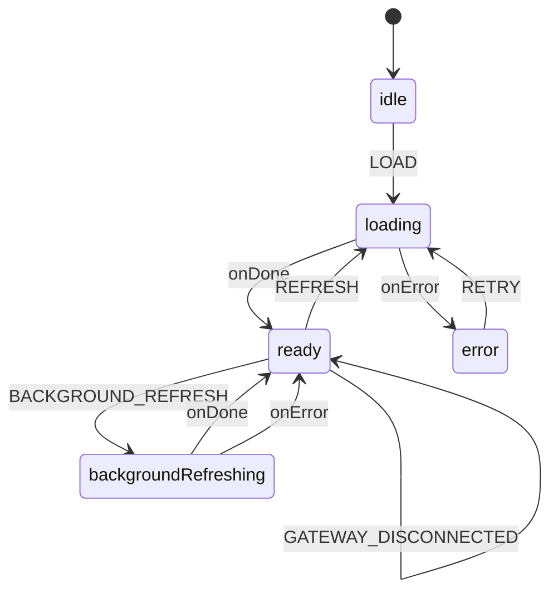
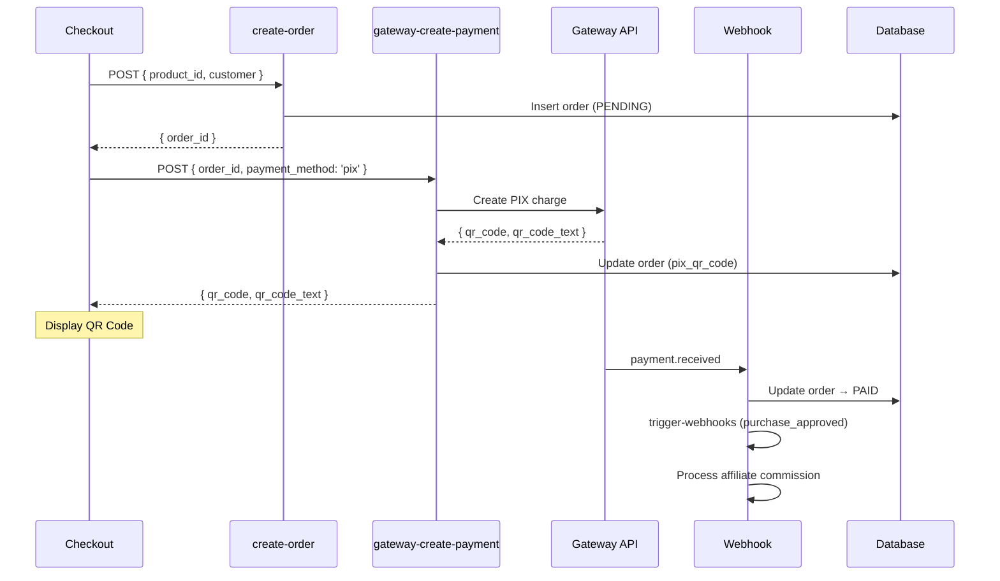
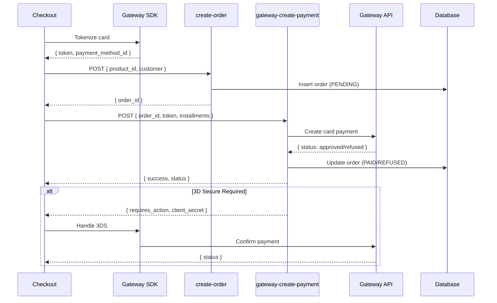

# Financeiro Module - Architecture Documentation

> **Version:** 1.0.0  
> **Last Updated:** 2026-01-22  
> **RISE Score:** 10.0/10  
> **Status:** Production Ready

## 1. Overview

O módulo Financeiro gerencia todas as integrações de pagamento da plataforma RiseCheckout, seguindo estritamente o RISE Protocol V3.

### 1.1 Propósito

- Gerenciamento centralizado de 4 gateways de pagamento
- Processamento de PIX e Cartão de Crédito
- Split de pagamentos (Marketplace/Afiliados)
- Webhooks com Dead Letter Queue (DLQ)

### 1.2 Gateways Suportados

| Gateway | PIX | Cartão | Boleto | Status |
|---------|-----|--------|--------|--------|
| Asaas | ✅ | ✅ | ✅ | Active |
| Mercado Pago | ✅ | ✅ | ❌ | Active |
| Stripe | ✅ | ✅ | ❌ | Active |
| PushinPay | ✅ | ❌ | ❌ | Active |

### 1.3 SSOT Architecture

```
FinanceiroContext (XState v5)
         │
         ▼
┌─────────────────────────────────────┐
│        financeiroMachine            │
│  ┌─────────────────────────────┐   │
│  │ States: idle → loading →    │   │
│  │         ready ⇄ background  │   │
│  │         ↓                   │   │
│  │       error                 │   │
│  └─────────────────────────────┘   │
└─────────────────────────────────────┘
         │
         ▼
┌─────────────────────────────────────┐
│     Gateway Components (Props)      │
│  AsaasConfig │ MPConfig │ Stripe   │
└─────────────────────────────────────┘
```

---

## 2. State Machine Architecture

### 2.1 financeiroMachine Diagram



### 2.2 Context Shape

```typescript
interface FinanceiroMachineContext {
  connectionStatuses: GatewayConnectionMap;
  selectedGateway: GatewayId | null;
  loadError: string | null;
  lastRefreshAt: number | null;
  isBackgroundRefreshing: boolean;
}
```

### 2.3 Events

| Event | Description |
|-------|-------------|
| `LOAD` | Carrega status inicial dos gateways |
| `REFRESH` | Recarrega com loading visível |
| `BACKGROUND_REFRESH` | Recarrega sem bloquear UI |
| `SELECT_GATEWAY` | Seleciona gateway para configuração |
| `DESELECT_GATEWAY` | Limpa seleção |
| `GATEWAY_CONNECTED` | Atualiza status após conexão OAuth |
| `GATEWAY_DISCONNECTED` | Atualiza status após desconexão |

---

## 3. Edge Functions Registry

### 3.1 Order Creation

| Function | Description | Lines | Handlers |
|----------|-------------|-------|----------|
| `create-order` | Cria pedido inicial | 267 | 6 handlers |

**Handlers de create-order:**
- `product-validator.ts` - Valida produto e oferta
- `bump-processor.ts` - Processa order bumps
- `coupon-processor.ts` - Aplica cupons
- `affiliate/processor.ts` - Calcula comissões
- `order-creator.ts` - Persiste pedido
- `response-builder.ts` - Formata resposta

### 3.2 Payment Creation (por Gateway)

| Function | Gateway | PIX | Card | Lines |
|----------|---------|-----|------|-------|
| `mercadopago-create-payment` | Mercado Pago | ✅ | ✅ | 239 |
| `stripe-create-payment` | Stripe | ✅ | ✅ | 185 |
| `asaas-create-payment` | Asaas | ✅ | ✅ | 212 |
| `pushinpay-create-pix` | PushinPay | ✅ | ❌ | 236 |

### 3.3 Webhooks

| Function | Gateway | DLQ | Lines | Events Handled |
|----------|---------|-----|-------|----------------|
| `mercadopago-webhook` | MP | ✅ | 243 | payment.created, payment.updated |
| `stripe-webhook` | Stripe | ❌ | 243 | payment_intent.succeeded/failed |
| `asaas-webhook` | Asaas | ✅ | 280 | PAYMENT_RECEIVED, PAYMENT_OVERDUE |
| `pushinpay-webhook` | PushinPay | ✅ | 276 | pix.received |

### 3.4 Validation & OAuth

| Function | Gateway | Purpose | Lines |
|----------|---------|---------|-------|
| `mercadopago-oauth` | MP | OAuth flow | 187 |
| `stripe-connect-oauth` | Stripe | Connect OAuth | 234 |
| `asaas-validate-credentials` | Asaas | API key validation | 217 |
| `pushinpay-validate` | PushinPay | Token validation | 156 |

### 3.5 Integration Management

| Function | Purpose | Lines |
|----------|---------|-------|
| `integration-management` | CRUD de integrações | 245 |

---

## 4. Frontend Architecture

### 4.1 Directory Structure

```
src/
├── modules/financeiro/
│   ├── machines/
│   │   ├── financeiroMachine.ts       # XState v5 (170 lines)
│   │   ├── financeiroMachine.types.ts # Types (75 lines)
│   │   └── financeiroMachine.actors.ts # Actors (103 lines)
│   ├── context/
│   │   └── FinanceiroContext.tsx      # SSOT Provider (142 lines)
│   └── components/
│       └── FinanceiroPage.tsx         # Main page
│
├── integrations/gateways/
│   ├── asaas/
│   │   ├── api/                       # Modular API (3 files)
│   │   ├── hooks.ts                   # React Query hooks
│   │   ├── types.ts                   # TypeScript interfaces
│   │   └── components/                # UI components
│   │
│   ├── mercadopago/
│   │   ├── api/                       # payment-api.ts
│   │   ├── hooks.ts
│   │   ├── types.ts
│   │   └── components/
│   │
│   ├── stripe/
│   │   ├── api.ts
│   │   ├── hooks.ts
│   │   ├── types.ts
│   │   └── components/
│   │
│   └── pushinpay/
│       ├── api.ts
│       ├── hooks.ts
│       ├── types.ts
│       └── components/
│
└── config/gateways/
    ├── registry.ts                    # Gateway definitions
    └── types.ts                       # Shared types
```

### 4.2 Data Flow (SSOT)

```
┌─────────────────────────────────────────────────────────────┐
│                    FinanceiroContext                        │
│  ┌─────────────────────────────────────────────────────┐   │
│  │              financeiroMachine (XState)              │   │
│  │                                                      │   │
│  │  context.connectionStatuses = {                     │   │
│  │    asaas: { connected: true, mode: 'production' },  │   │
│  │    mercadopago: { connected: false, mode: null },   │   │
│  │    stripe: { connected: true, mode: 'test' },       │   │
│  │    pushinpay: { connected: false, mode: null }      │   │
│  │  }                                                  │   │
│  └─────────────────────────────────────────────────────┘   │
└─────────────────────────────────────────────────────────────┘
                              │
                              │ useFinanceiroContext()
                              ▼
┌─────────────────────────────────────────────────────────────┐
│                   Gateway Components                        │
│                                                             │
│  ┌─────────────┐  ┌─────────────┐  ┌─────────────┐        │
│  │ AsaasConfig │  │  MPConfig   │  │StripeConfig │        │
│  │             │  │             │  │             │        │
│  │ Props:      │  │ Props:      │  │ Props:      │        │
│  │ connection  │  │ connection  │  │ connection  │        │
│  │ Status ←────┼──┼─────────────┼──┼─────────────│        │
│  └─────────────┘  └─────────────┘  └─────────────┘        │
└─────────────────────────────────────────────────────────────┘
```

---

## 5. Payment Flows

### 5.1 PIX Payment Flow



### 5.2 Credit Card Payment Flow



---

## 6. Split Payment Model (Cakto)

### 6.1 Split Rules

```
┌─────────────────────────────────────────────────────────────┐
│                    MODELO CAKTO PROPORCIONAL                 │
├─────────────────────────────────────────────────────────────┤
│                                                              │
│  Valor Bruto: R$ 100,00                                     │
│                                                              │
│  1. Taxa Plataforma (4%): R$ 4,00 → RiseCheckout            │
│                                                              │
│  2. Valor Líquido: R$ 96,00                                 │
│                                                              │
│  3. Se há afiliado (30% comissão):                          │
│     - Comissão: R$ 96,00 × 30% = R$ 28,80 → Afiliado        │
│     - Produtor: R$ 96,00 - R$ 28,80 = R$ 67,20              │
│                                                              │
│  4. Se não há afiliado:                                      │
│     - Produtor: R$ 96,00                                    │
│                                                              │
└─────────────────────────────────────────────────────────────┘
```

### 6.2 Split Implementation by Gateway

| Gateway | Split Method | Notes |
|---------|--------------|-------|
| Asaas | `split[]` array | walletId + percentual |
| Mercado Pago | `application_fee` | Platform fee only |
| Stripe | `transfer_data.destination` | Connect transfers |
| PushinPay | Manual transfer | Post-payment |

---

## 7. Adding New Gateways

### 7.1 Checklist

```markdown
## Gateway Integration Checklist

### Backend (Edge Functions)
- [ ] Create `supabase/functions/{gateway}-create-payment/`
  - [ ] index.ts (router, < 300 lines)
  - [ ] handlers/pix-handler.ts
  - [ ] handlers/card-handler.ts (if supported)
  - [ ] README.md
- [ ] Create `supabase/functions/{gateway}-webhook/`
  - [ ] index.ts
  - [ ] handlers/payment-handler.ts
  - [ ] README.md
- [ ] Create `supabase/functions/{gateway}-validate-credentials/`
- [ ] Add adapter to `_shared/payment-gateways/`
- [ ] Update PaymentFactory.ts

### Frontend
- [ ] Create `src/integrations/gateways/{gateway}/`
  - [ ] api.ts (Edge Function calls)
  - [ ] hooks.ts (React Query)
  - [ ] types.ts (TypeScript interfaces)
  - [ ] components/ConfigForm.tsx
  - [ ] README.md
- [ ] Add to GatewayRegistry (`src/config/gateways/registry.ts`)
- [ ] Add to GatewayId type (`src/config/gateways/types.ts`)

### Database
- [ ] Add IntegrationType enum value
- [ ] Test vendor_integrations compatibility

### Documentation
- [ ] Update EDGE_FUNCTIONS_REGISTRY.md
- [ ] Update this file (FINANCEIRO_MODULE.md)
```

### 7.2 File Structure Template

```
src/integrations/gateways/{gateway}/
├── api.ts                    # API calls to Edge Functions
├── hooks.ts                  # React Query hooks
├── types.ts                  # TypeScript interfaces
├── components/
│   ├── ConfigForm.tsx        # Connection form
│   ├── StatusBadge.tsx       # Connection status
│   └── index.ts              # Exports
└── README.md                 # Integration documentation

supabase/functions/{gateway}-create-payment/
├── index.ts                  # Router (< 300 lines)
├── handlers/
│   ├── pix-handler.ts        # PIX logic
│   ├── card-handler.ts       # Card logic
│   └── response-builder.ts   # Response formatting
└── README.md                 # API documentation
```

---

## 8. Security

### 8.1 Encryption

| Data | Method | Storage |
|------|--------|---------|
| CPF/CNPJ | AES-256-GCM | orders.customer_document_encrypted |
| Phone | AES-256-GCM | orders.customer_phone_encrypted |
| Card Token | Gateway-managed | Never stored |

### 8.2 Rate Limiting

```typescript
// Configuration per gateway
RATE_LIMIT_CONFIGS = {
  ASAAS_CREATE_PAYMENT: {
    maxRequests: 10,
    windowSeconds: 60,
    blockDurationSeconds: 300
  },
  MERCADOPAGO_CREATE_PAYMENT: {
    maxRequests: 15,
    windowSeconds: 60,
    blockDurationSeconds: 180
  },
  STRIPE_CREATE_PAYMENT: {
    maxRequests: 20,
    windowSeconds: 60,
    blockDurationSeconds: 120
  }
}
```

### 8.3 Webhook Security

| Gateway | Validation Method |
|---------|-------------------|
| Stripe | `stripe.webhooks.constructEvent()` signature |
| Mercado Pago | `x-signature` header + secret |
| Asaas | `asaas-access-token` header |
| PushinPay | `x-webhook-secret` header |

### 8.4 Dead Letter Queue (DLQ)

```sql
-- Webhook failures are stored for retry
INSERT INTO webhook_dead_letter_queue (
  gateway,
  event_type,
  payload,
  error_message,
  retry_count,
  next_retry_at
) VALUES (...);

-- Automated retry via pg_cron
SELECT process_dlq_webhooks();
```

---

## 9. Troubleshooting

### 9.1 Common Issues

| Issue | Cause | Solution |
|-------|-------|----------|
| "Gateway not connected" | OAuth expired | Re-authenticate via Financeiro page |
| PIX timeout | Webhook not received | Check DLQ, verify webhook URL |
| Split not applied | Missing walletId | Verify affiliate profile configuration |
| 3DS loop | Stripe misconfiguration | Check return_url and confirm_card_payment |

### 9.2 Debug Queries

```sql
-- Check recent payments by gateway
SELECT gateway, status, COUNT(*) 
FROM orders 
WHERE created_at > NOW() - INTERVAL '1 day'
GROUP BY gateway, status;

-- Check webhook failures
SELECT * FROM webhook_dead_letter_queue
WHERE retry_count < 5
ORDER BY created_at DESC;

-- Check gateway connection status
SELECT integration_type, active, config->>'environment'
FROM vendor_integrations
WHERE vendor_id = 'xxx';
```

---

## 10. Changelog

| Version | Date | Changes |
|---------|------|---------|
| 1.0.0 | 2026-01-22 | Initial documentation (RISE V3 Audit) |

---

## 11. References

- [EDGE_FUNCTIONS_REGISTRY.md](./EDGE_FUNCTIONS_REGISTRY.md)
- [STATUS_ATUAL.md](./STATUS_ATUAL.md)
- [Gateway READMEs](../src/integrations/gateways/)
- [Supabase Functions](../supabase/functions/)
