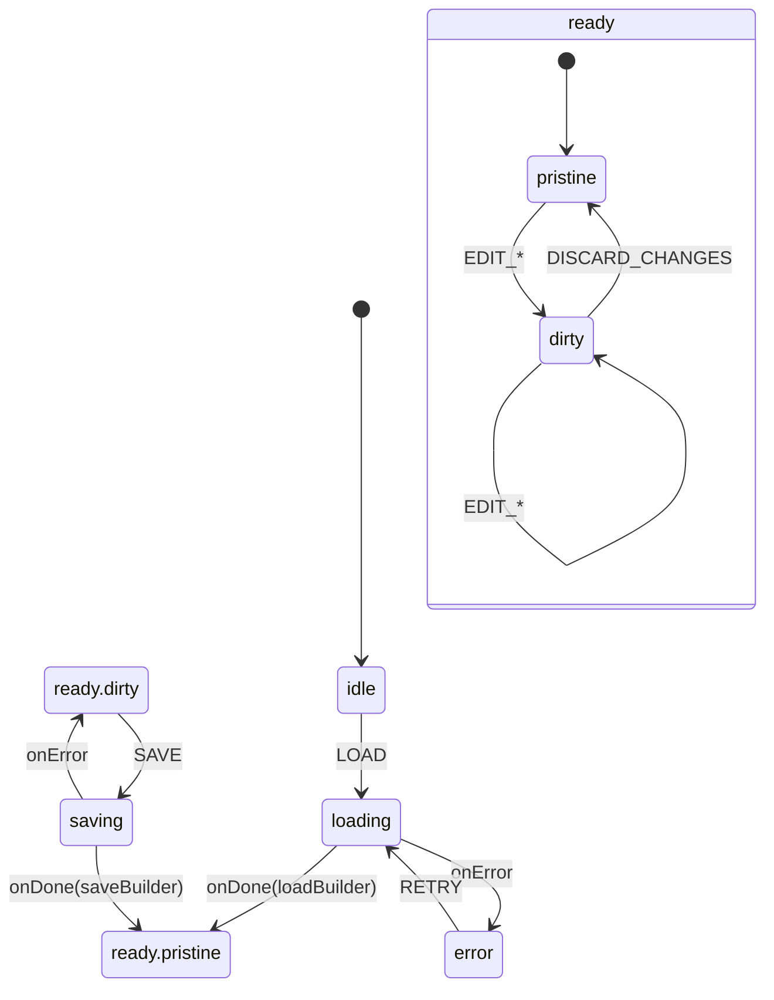

# Members Area Builder Module - Arquitetura Técnica

> **Versão:** 2.0 (Dual-Layout)
> **Data:** 25 de Janeiro de 2026  
> **Status:** CONSOLIDADO - RISE V3 10.0/10  

---

## 1. Visão Geral

O módulo **Members Area Builder** é um construtor visual (drag-and-drop) para personalizar a área de membros. Segue o **RISE ARCHITECT PROTOCOL V3**.

### 1.1 Localização

```
src/modules/members-area-builder/
```

### 1.2 Responsabilidades

- Construção visual de seções (Banner, Módulos, Cursos, Texto, Espaçador)
- **Layouts independentes para Desktop e Mobile (NEW v2.0)**
- Configurações globais (tema, cores, menu)
- Preview desktop/mobile
- Persistência via Edge Functions

### 1.3 Dual-Layout Architecture (v2.0)

O builder suporta layouts completamente independentes:

| Feature | Descrição |
|---------|-----------|
| `desktopSections` | Seções exclusivas para Desktop |
| `mobileSections` | Seções exclusivas para Mobile |
| `isMobileSynced` | Quando true, Desktop é espelhado no Mobile |
| `copyDesktopToMobile` | Copia layout do Desktop para Mobile |

---

## 2. Estrutura de Diretórios

```
src/modules/members-area-builder/
├── index.ts                    # Public API
├── registry.ts                 # Section type registry
├── types/
│   └── builder.types.ts        # Tipos canônicos
├── hooks/
│   ├── index.ts
│   ├── useMembersAreaBuilder.ts
│   ├── useMembersAreaState.ts
│   └── useMembersAreaParsers.ts
├── machines/
│   ├── index.ts
│   ├── builderMachine.ts
│   ├── builderMachine.types.ts
│   ├── builderMachine.guards.ts
│   ├── builderMachine.actions.ts
│   └── builderMachine.actors.ts
├── pages/
│   └── MembersAreaBuilderPage.tsx
└── components/
    ├── canvas/
    ├── header/
    ├── sidebar/
    │   ├── BuilderSidebar.tsx
    │   ├── ViewportSyncPanel.tsx  # NEW v2.0
    │   └── ...
    ├── preview/
    ├── dialogs/
    └── sections/
```

---

## 3. State Machine (v2.0)

`builderMachine.ts` gerencia o ciclo de vida do builder com os estados:

- `idle` → Estado inicial
- `loading` → Carregando dados do backend
- `ready.pristine` → Dados carregados, sem alterações
- `ready.dirty` → Alterações pendentes de salvamento
- `saving` → Persistindo alterações
- `error` → Estado de erro

### 3.1 Diagrama de Estados



### 3.2 Eventos Principais

| Evento | Descrição |
|--------|-----------|
| `LOAD` | Carrega builder do backend |
| `EDIT_SETTINGS` | Atualiza configurações globais |
| `ADD_SECTION` | Adiciona nova seção |
| `UPDATE_SECTION` | Atualiza seção existente |
| `DELETE_SECTION` | Remove seção |
| `REORDER_SECTIONS` | Reordena seções via drag-and-drop |
| `SELECT_SECTION` | Seleciona seção para edição |
| `SAVE` | Persiste alterações no backend |
| `DISCARD_CHANGES` | Descarta alterações pendentes |

---

## 4. Tipos de Seção

| Tipo | Label | Duplicável | Obrigatório | Max |
|------|-------|------------|-------------|-----|
| `banner` | Banner | ❌ | ✅ | 1 |
| `modules` | Módulos | ❌ | ✅ | 1 |
| `courses` | Cursos | ✅ | ❌ | ∞ |
| `continue_watching` | Continuar Assistindo | ❌ | ❌ | 1 |
| `text` | Texto | ✅ | ❌ | ∞ |
| `spacer` | Espaçador | ✅ | ❌ | ∞ |

### 4.1 Registry

O arquivo `registry.ts` define as regras de cada tipo de seção:

```typescript
export const SECTION_REGISTRY: Record<SectionType, SectionMeta> = {
  banner: { label: 'Banner', duplicable: false, required: true, max: 1 },
  modules: { label: 'Módulos', duplicable: false, required: true, max: 1 },
  courses: { label: 'Cursos', duplicable: true, required: false },
  // ...
};
```

---

## 5. Componentes Principais

### 5.1 Canvas

- `BuilderCanvas.tsx` - Área principal de drag-and-drop
- `SectionCard.tsx` - Card visual de cada seção
- `DropZone.tsx` - Zona de drop entre seções

### 5.2 Sidebar

- `BuilderSidebar.tsx` - Painel lateral de edição
- `SectionEditor.tsx` - Editor contextual por tipo de seção
- `SettingsPanel.tsx` - Configurações globais

### 5.3 Section Editors

Cada tipo de seção tem seu editor dedicado:

- `BannerEditor.tsx`
- `ModulesEditor.tsx`
- `CoursesEditor.tsx`
- `TextEditor.tsx`
- `SpacerEditor.tsx`

---

## 6. Integração com Backend

### 6.1 Edge Functions

| Função | Ação | Descrição |
|--------|------|-----------|
| `admin-data` | `get-members-area-builder` | Carrega builder |
| `admin-data` | `save-members-area-builder` | Salva builder |

### 6.2 Tabelas

| Tabela | Uso |
|--------|-----|
| `product_members_area_sections` | Seções do builder |
| `products.members_area_settings` | Configurações globais |

---

## 7. Conformidade RISE V3

| Critério | Status | Nota |
|----------|--------|------|
| XState SSOT | ✅ | 10/10 |
| < 300 Linhas | ✅ | 10/10 |
| Zero console.log | ✅ | 10/10 |
| BFF Pattern | ✅ | 10/10 |
| TypeScript Strict | ✅ | 10/10 |
| Zero TODOs | ✅ | 10/10 |
| Documentação | ✅ | 10/10 |
| **NOTA FINAL** | ✅ | **10.0/10** |

---

## 8. Arquivos e Contagem de Linhas

| Arquivo | Linhas | Status |
|---------|--------|--------|
| `builderMachine.ts` | 279 | ✅ |
| `builderMachine.types.ts` | ~120 | ✅ |
| `builderMachine.guards.ts` | ~45 | ✅ |
| `builderMachine.actions.ts` | ~85 | ✅ |
| `builderMachine.actors.ts` | ~180 | ✅ |
| `useMembersAreaBuilder.ts` | ~150 | ✅ |
| `useMembersAreaState.ts` | ~200 | ✅ |
| `MembersAreaBuilderPage.tsx` | ~180 | ✅ |

**Total:** ~1.239 linhas (todos < 300)

---

## 9. Changelog

| Versão | Data | Alterações |
|--------|------|------------|
| 1.0 | 2026-01-22 | Documentação inicial após auditoria RISE V3 |

---

**FIM DA DOCUMENTAÇÃO**
