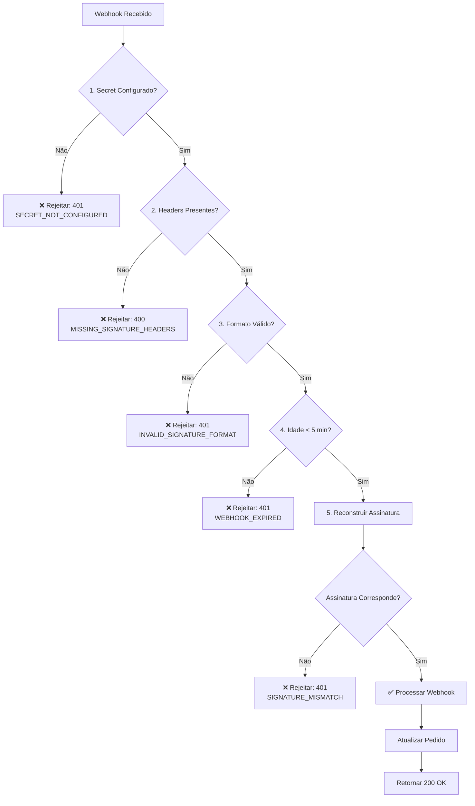

# Documentação de Segurança: Webhook do Mercado Pago

**Autor:** Manus AI  
**Data:** 12 de Dezembro de 2025  
**Versão da Função:** 144+  
**Status:** ✅ Implementado e Ativo

---

## 1. Visão Geral

A Edge Function `mercadopago-webhook` foi atualizada para implementar **validação rigorosa de assinatura HMAC-SHA256**, protegendo o sistema contra ataques de replay e forja de webhooks.

### 1.1. Problema Resolvido

**Antes (v143):** A função possuía código de validação de assinatura, mas **permitia que webhooks inválidos passassem**, retornando `{ valid: true, skipped: true }` mesmo quando a validação falhava.

**Agora (v144+):** A função **rejeita** webhooks inválidos com códigos HTTP apropriados (400, 401), garantindo que apenas webhooks autênticos do Mercado Pago sejam processados.

### 1.2. Impacto de Segurança

| Vulnerabilidade | Antes (v143) | Agora (v144+) |
| :--- | :--- | :--- |
| **Ataques de Replay** | ❌ Vulnerável | ✅ Protegido (verificação de timestamp) |
| **Forja de Webhooks** | ❌ Vulnerável | ✅ Protegido (validação HMAC-SHA256) |
| **Webhooks Expirados** | ❌ Aceitos | ✅ Rejeitados (> 5 minutos) |
| **Webhooks sem Assinatura** | ❌ Aceitos | ✅ Rejeitados (401) |

---

## 2. Arquitetura de Validação

A validação é implementada em **5 camadas sequenciais**:



### 2.1. Camada 1: Verificação do Secret

```typescript
const webhookSecret = Deno.env.get('MERCADOPAGO_WEBHOOK_SECRET');

if (!webhookSecret) {
  logError('🔴 MERCADOPAGO_WEBHOOK_SECRET não configurado - REJEITANDO webhook');
  return { valid: false, error: ERROR_CODES.SECRET_NOT_CONFIGURED };
}
```

**Resultado:** Se o secret não estiver configurado, o webhook é **rejeitado com 401**.

### 2.2. Camada 2: Verificação dos Headers

```typescript
const xSignature = req.headers.get('x-signature');
const xRequestId = req.headers.get('x-request-id');

if (!xSignature || !xRequestId) {
  logError('🔴 Headers de assinatura ausentes - REJEITANDO webhook');
  return { valid: false, error: ERROR_CODES.MISSING_SIGNATURE_HEADERS };
}
```

**Resultado:** Se os headers `x-signature` ou `x-request-id` estiverem ausentes, o webhook é **rejeitado com 400**.

### 2.3. Camada 3: Validação do Formato

```typescript
const parts = xSignature.split(',');
const tsMatch = parts.find(p => p.startsWith('ts='));
const v1Match = parts.find(p => p.startsWith('v1='));

if (!tsMatch || !v1Match) {
  logError('🔴 Formato de assinatura inválido - REJEITANDO webhook');
  return { valid: false, error: ERROR_CODES.INVALID_SIGNATURE_FORMAT };
}
```

**Resultado:** Se o formato não for `ts=<timestamp>,v1=<hash>`, o webhook é **rejeitado com 401**.

### 2.4. Camada 4: Verificação de Idade (Proteção contra Replay)

```typescript
const now = Math.floor(Date.now() / 1000);
const age = now - parseInt(timestamp);

if (age > SIGNATURE_MAX_AGE) { // 300 segundos = 5 minutos
  logError('🔴 Webhook expirado - REJEITANDO');
  return { valid: false, error: ERROR_CODES.WEBHOOK_EXPIRED };
}
```

**Resultado:** Se o webhook tiver mais de 5 minutos, é **rejeitado com 401**.

### 2.5. Camada 5: Validação da Assinatura HMAC-SHA256

```typescript
const manifest = `id:${dataId};request-id:${xRequestId};ts:${timestamp};`;
const expectedHash = await generateHmacSignature(webhookSecret, manifest);

if (expectedHash !== receivedHash) {
  logError('🔴 Assinatura não corresponde - REJEITANDO webhook');
  return { valid: false, error: ERROR_CODES.SIGNATURE_MISMATCH };
}
```

**Resultado:** Se a assinatura não corresponder, o webhook é **rejeitado com 401**.

---

## 3. Configuração

### 3.1. Variável de Ambiente

A função requer que a variável de ambiente `MERCADOPAGO_WEBHOOK_SECRET` esteja configurada no Supabase.

**Como configurar:**

1. Acesse o Supabase Dashboard
2. Navegue para **Settings** > **Edge Functions** > **Secrets**
3. Adicione o secret:
   - **Nome:** `MERCADOPAGO_WEBHOOK_SECRET`
   - **Valor:** O secret fornecido pelo Mercado Pago

### 3.2. Configuração de JWT

A função deve ter `verify_jwt = false` no `supabase/config.toml`:

```toml
[functions.mercadopago-webhook]
verify_jwt = false
```

**Por quê?** Webhooks do Mercado Pago não enviam JWT tokens do Supabase, portanto a autenticação JWT deve ser desabilitada.

---

## 4. Testes de Segurança

Um script de teste Python foi criado para validar a implementação: `test_mercadopago_webhook_security.py`

### 4.1. Executar os Testes

```bash
# 1. Instalar dependências
pip3 install requests

# 2. Editar o script e substituir WEBHOOK_SECRET
nano test_mercadopago_webhook_security.py

# 3. Executar
python3 test_mercadopago_webhook_security.py
```

### 4.2. Testes Implementados

| Teste | Descrição | Resultado Esperado |
| :--- | :--- | :--- |
| **Teste 1** | Webhook válido com assinatura correta | 200 OK (ou 404 se pedido não existir) |
| **Teste 2** | Webhook sem headers de assinatura | 401 Unauthorized |
| **Teste 3** | Webhook com assinatura inválida | 401 Unauthorized |
| **Teste 4** | Webhook expirado (> 5 minutos) | 401 Unauthorized |
| **Teste 5** | Webhook com formato de assinatura incorreto | 401 Unauthorized |

---

## 5. Monitoramento e Logs

### 5.1. Logs de Segurança

Todos os eventos de validação são logados com emojis para fácil identificação:

| Evento | Emoji | Nível | Exemplo |
| :--- | :--- | :--- | :--- |
| Secret não configurado | 🔴 | ERROR | `🔴 MERCADOPAGO_WEBHOOK_SECRET não configurado - REJEITANDO webhook` |
| Headers ausentes | 🔴 | ERROR | `🔴 Headers de assinatura ausentes - REJEITANDO webhook` |
| Formato inválido | 🔴 | ERROR | `🔴 Formato de assinatura inválido - REJEITANDO webhook` |
| Webhook expirado | 🔴 | ERROR | `🔴 Webhook expirado - REJEITANDO` |
| Assinatura inválida | 🔴 | ERROR | `🔴 Assinatura não corresponde - REJEITANDO webhook` |
| Validação bem-sucedida | ✅ | INFO | `✅ Assinatura validada com sucesso` |

### 5.2. Como Visualizar os Logs

1. Acesse o Supabase Dashboard
2. Navegue para **Edge Functions** > **mercadopago-webhook** > **Logs**
3. Filtre por `[ERROR]` para ver tentativas de webhooks inválidos

---

## 6. Códigos de Erro

| Código | Descrição | Status HTTP |
| :--- | :--- | :--- |
| `SECRET_NOT_CONFIGURED` | `MERCADOPAGO_WEBHOOK_SECRET` não configurado | 401 |
| `MISSING_SIGNATURE_HEADERS` | Headers `x-signature` ou `x-request-id` ausentes | 400 |
| `INVALID_SIGNATURE_FORMAT` | Formato da assinatura não é `ts=...,v1=...` | 401 |
| `WEBHOOK_EXPIRED` | Webhook tem mais de 5 minutos | 401 |
| `SIGNATURE_MISMATCH` | Assinatura HMAC-SHA256 não corresponde | 401 |
| `VALIDATION_ERROR` | Erro ao processar validação | 401 |

---

## 7. Troubleshooting

### 7.1. Webhooks Legítimos Sendo Rejeitados

**Sintoma:** Logs mostram `🔴 Assinatura não corresponde` para webhooks reais do Mercado Pago.

**Possíveis Causas:**

1. **Secret incorreto:** Verifique se o `MERCADOPAGO_WEBHOOK_SECRET` no Supabase corresponde ao secret configurado no Mercado Pago.
2. **Diferença de relógio:** Se o servidor do Mercado Pago tiver um relógio dessincronizado, o timestamp pode estar fora do limite de 5 minutos.

**Solução:**

```bash
# Verificar o secret configurado
manus-mcp-cli tool call execute_sql --server supabase --input '{
  "project_id": "wivbtmtgpsxupfjwwovf",
  "query": "SELECT * FROM vault.secrets WHERE name = '\''MERCADOPAGO_WEBHOOK_SECRET'\''"
}'
```

### 7.2. Erro "Secret Not Configured"

**Sintoma:** Logs mostram `🔴 MERCADOPAGO_WEBHOOK_SECRET não configurado`.

**Solução:** Configure o secret no Supabase Dashboard (ver seção 3.1).

---

## 8. Referências

- [Documentação Oficial do Mercado Pago - Webhooks](https://www.mercadopago.com.br/developers/pt/docs/your-integrations/notifications/webhooks)
- [Documentação Oficial - Validação de Assinatura](https://www.mercadopago.com.br/developers/pt/docs/your-integrations/notifications/webhooks#bookmark_validar_a_origem_da_notifica%C3%A7%C3%A3o)
- [Supabase Edge Functions - Environment Variables](https://supabase.com/docs/guides/functions/secrets)

---

## 9. Histórico de Versões

| Versão | Data | Mudanças |
| :--- | :--- | :--- |
| **v144** | 2025-12-12 | 🔒 **SECURITY FIX:** Implementada validação rigorosa de assinatura HMAC-SHA256. Webhooks inválidos agora são rejeitados. |
| v143 | 2025-XX-XX | Validação de assinatura implementada, mas não rejeitava webhooks inválidos. |

---

**Última Atualização:** 12 de Dezembro de 2025  
**Responsável:** Manus AI  
**Status:** ✅ Produção
