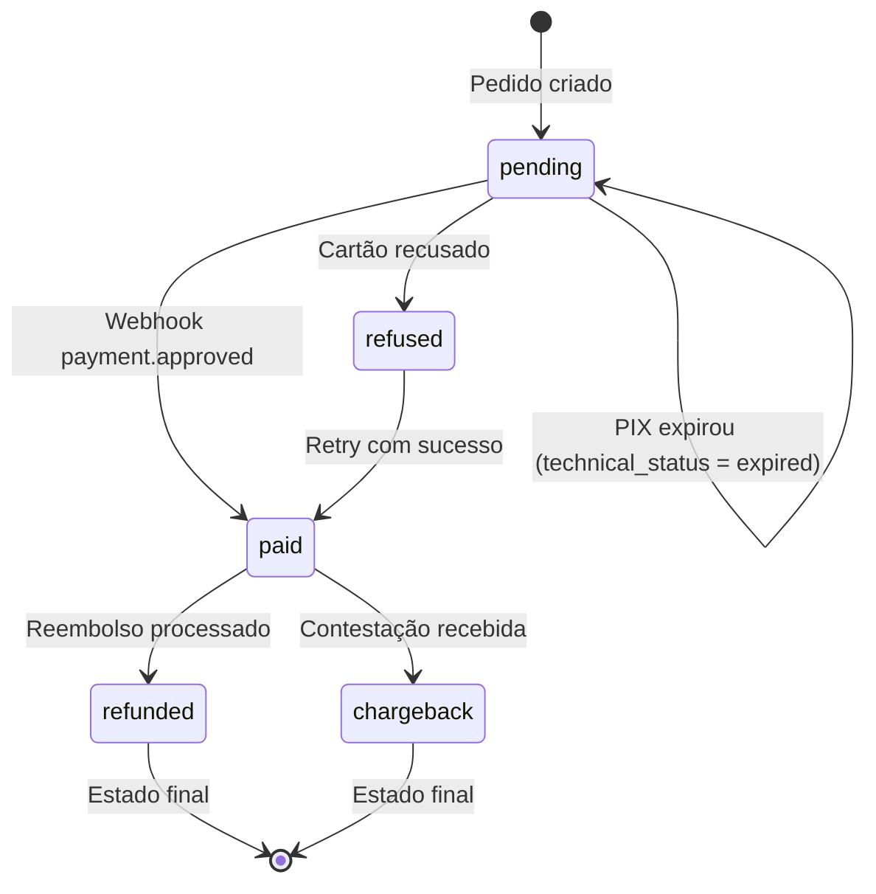

# Sistema de Status de Pedidos - RiseCheckout

## Padrão de Mercado: Hotmart/Kiwify/Cakto

O RiseCheckout segue o modelo de status **padrão de mercado** utilizado por plataformas como Hotmart, Kiwify e Cakto. Neste modelo:

> **Uma venda PIX pendente NUNCA se torna "cancelada" na interface do usuário.**
> **Cartões recusados recebem status próprio: "Recusado".**

Isso permite:
1. **Métricas de conversão precisas** - Vendas perdidas são analisadas separadamente
2. **Recuperação de vendas** - PIX expirado pode ser reprocessado
3. **Diagnóstico de recusas** - Cartões recusados são rastreados separadamente
4. **Consistência com mercado** - Mesma experiência que plataformas líderes

---

## Arquitetura Dual-Layer

O sistema utiliza duas camadas de status:

| Camada | Campo | Propósito | Visibilidade |
|--------|-------|-----------|--------------|
| **Pública** | `status` | UI e clientes | Dashboard, relatórios |
| **Técnica** | `technical_status` | Diagnóstico interno | Apenas backend |

### Campos no Banco de Dados

```sql
-- Coluna principal (5 valores possíveis)
status TEXT NOT NULL DEFAULT 'pending'
  CHECK (status IN ('paid', 'pending', 'refused', 'refunded', 'chargeback'))

-- Coluna técnica (6 valores possíveis)
technical_status TEXT DEFAULT 'active'
  CHECK (technical_status IN ('active', 'expired', 'gateway_cancelled', 
         'gateway_timeout', 'gateway_error', 'abandoned'))

-- Timestamp de expiração
expired_at TIMESTAMPTZ
```

---

## Status Canônicos (Camada Pública)

Apenas **5 status** são exibidos ao usuário:

| Status | Display | Cor | Descrição |
|--------|---------|-----|-----------|
| `paid` | Pago | 🟢 Verde (emerald) | Pagamento confirmado |
| `pending` | Pendente | 🟡 Amarelo (amber) | Aguardando pagamento |
| `refused` | Recusado | 🔴 Vermelho (red) | Cartão recusado |
| `refunded` | Reembolso | 🔴 Vermelho (red) | Valor devolvido |
| `chargeback` | Chargeback | 🔴 Vermelho (red) | Contestação de cartão |

### Cores CSS

```typescript
const STATUS_COLORS = {
  paid: { bg: 'bg-emerald-500/10', text: 'text-emerald-500', dot: 'bg-emerald-500' },
  pending: { bg: 'bg-amber-500/10', text: 'text-amber-500', dot: 'bg-amber-500' },
  refused: { bg: 'bg-red-500/10', text: 'text-red-500', dot: 'bg-red-500' },
  refunded: { bg: 'bg-red-500/10', text: 'text-red-500', dot: 'bg-red-500' },
  chargeback: { bg: 'bg-red-500/10', text: 'text-red-500', dot: 'bg-red-500' },
};
```

---

## Technical Status (Camada Interna)

Para diagnóstico e relatórios avançados, **6 status técnicos**:

| Technical Status | Descrição | Status Público |
|------------------|-----------|----------------|
| `active` | PIX/boleto ativo, aguardando | `pending` |
| `expired` | PIX/boleto expirou | `pending` |
| `gateway_cancelled` | Cancelado pelo gateway | `pending` |
| `gateway_timeout` | Timeout na comunicação | `pending` |
| `gateway_error` | Erro no processamento | `pending` |
| `abandoned` | Checkout abandonado | `pending` |

**Importante:** Todos os status técnicos negativos resultam em `status = 'pending'` (para PIX).
Cartões recusados usam `status = 'refused'`.

---

## Diagrama de Transições


```mermaid
stateDiagram-v2
    [*] --> pending: Pedido criado
    
    pending --> paid: Webhook payment.approved
    pending --> pending: PIX expirou (technical_status = expired)
    pending --> refused: Cartão recusado
    
    refused --> paid: Retry com sucesso
    
    paid --> refunded: Reembolso processado
    paid --> chargeback: Contestação recebida
    
    refunded --> [*]: Estado final
    chargeback --> [*]: Estado final
```

---

## Mapeamento de Gateways

### Mercado Pago

| Status MP | Status Canônico | Technical Status |
|-----------|-----------------|------------------|
| `approved` | `paid` | - |
| `pending` | `pending` | `active` |
| `in_process` | `pending` | `active` |
| `rejected` | `refused` | - |
| `cancelled` | `pending` | `gateway_cancelled` |
| `refunded` | `refunded` | - |
| `charged_back` | `chargeback` | - |

### Asaas

| Status Asaas | Status Canônico | Technical Status |
|--------------|-----------------|------------------|
| `RECEIVED` | `paid` | - |
| `CONFIRMED` | `paid` | - |
| `PENDING` | `pending` | `active` |
| `OVERDUE` | `pending` | `expired` |
| `REFUNDED` | `refunded` | - |
| `DECLINED` | `refused` | - |

### PushinPay

| Status PushinPay | Status Canônico | Technical Status |
|------------------|-----------------|------------------|
| `paid` | `paid` | - |
| `pending` | `pending` | `active` |
| `expired` | `pending` | `expired` |
| `canceled` | `pending` | `gateway_cancelled` |
| `refunded` | `refunded` | - |

### Mapeamento Genérico de Recusas

| Status Gateway | Status Canônico |
|----------------|-----------------|
| `rejected` | `refused` |
| `declined` | `refused` |
| `failed` | `refused` |
| `card_declined` | `refused` |
| `cc_rejected` | `refused` |
| `error` | `refused` |

---

## Uso no Código

### Normalização de Status

```typescript
import { orderStatusService } from '@/lib/order-status';

// Normaliza qualquer status de gateway para canônico
const canonical = orderStatusService.normalize('rejected'); // 'refused'

// Obtém label para exibição
const label = orderStatusService.getDisplayLabel('refused'); // 'Recusado'

// Obtém cores
const colors = orderStatusService.getColorScheme('refused');
// { bg: 'bg-red-500/10', text: 'text-red-500', ... }

// Verifica se é recusado
const isRefused = orderStatusService.isRefused('card_declined'); // true
```

### Tipos TypeScript

```typescript
// Apenas estes 5 valores são válidos
type CanonicalOrderStatus = 'paid' | 'pending' | 'refused' | 'refunded' | 'chargeback';

// Para rastreamento interno
type TechnicalOrderStatus = 
  | 'active' 
  | 'expired' 
  | 'gateway_cancelled' 
  | 'gateway_timeout' 
  | 'gateway_error' 
  | 'abandoned';
```

---

## Casos de Uso

### 1. Dashboard de Vendas

```sql
-- Vendas aprovadas
SELECT COUNT(*) FROM orders WHERE status = 'paid';

-- Vendas pendentes (PIX aguardando)
SELECT COUNT(*) FROM orders WHERE status = 'pending';

-- Cartões recusados
SELECT COUNT(*) FROM orders WHERE status = 'refused';
```

### 2. Relatório de Vendas Perdidas

```sql
-- PIX que expiraram
SELECT * FROM orders 
WHERE status = 'pending' 
  AND technical_status = 'expired';

-- Cartões recusados
SELECT * FROM orders WHERE status = 'refused';
```

### 3. Recuperação de Vendas

```sql
-- Candidatas para email de recuperação
SELECT * FROM orders 
WHERE status IN ('pending', 'refused')
  AND created_at > NOW() - INTERVAL '7 days';
```

---

## Migração Histórica

Em **17 de Janeiro de 2026**, foi executada migração:

- **14 pedidos** com `status = 'cancelled'` → `status = 'pending'`, `technical_status = 'expired'`
- **0 pedidos** com `status = 'failed'` precisaram migração

Em **03 de Fevereiro de 2026**, foi adicionado:

- Status `refused` para cartões recusados
- Mapeamento de `rejected`, `declined`, `failed` → `refused`

---

## Código Fonte

| Arquivo | Propósito |
|---------|-----------|
| `src/lib/order-status/types.ts` | Tipos e constantes (5 status) |
| `src/lib/order-status/service.ts` | Serviço de normalização |
| `src/lib/order-status/index.ts` | Barrel export |
| `supabase/functions/_shared/webhook-helpers.ts` | Mapeamento de gateways |

---

## Referências

- [RISE ARCHITECT PROTOCOL V3](../RISE_PROTOCOL.md)
- [Changelog v3.2.0](./CHANGELOG.md)
- [Arquitetura Geral](./ARCHITECTURE.md)
