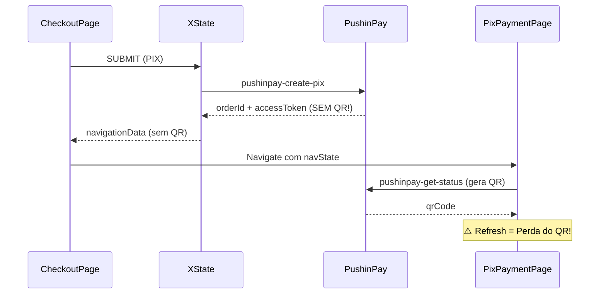
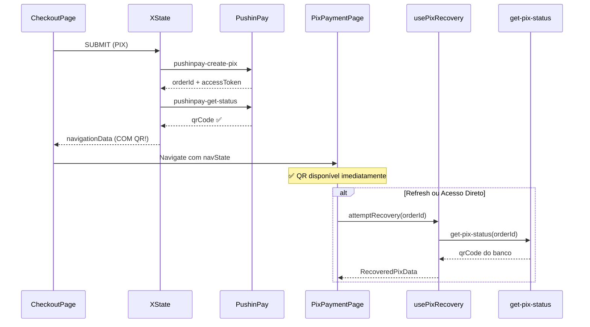

# PIX Payment Resilience Architecture

**Data:** 22 de Janeiro de 2026  
**Versão:** 1.0  
**Status:** ✅ RISE V3 10.0/10  
**Módulo:** `checkout-public` + `pix-payment`

---

## 1. Problema Original

O fluxo PIX anterior tinha fragilidades críticas:

| Problema | Impacto |
|----------|---------|
| Refresh da página perdia `navState` | Usuário via página em branco |
| Acesso direto via URL não funcionava | Link compartilhado era inutilizável |
| PushinPay delegava QR para página | Inconsistência arquitetural |
| Sem recuperação de dados do banco | Dependência total do navigation state |

### 1.1 Fluxo Problemático (Antes)



---

## 2. Solução: Arquitetura Resiliente

### 2.1 Componentes da Solução

| Componente | Arquivo | Responsabilidade |
|------------|---------|------------------|
| `processPixPaymentActor` | `machines/actors/processPixPaymentActor.ts` | Gera QR de TODOS os gateways |
| `get-pix-status` | `supabase/functions/get-pix-status/` | Recuperação pública via orderId |
| `usePixRecovery` | `pages/pix-payment/hooks/usePixRecovery.ts` | Hook de recuperação multi-estratégia |
| `PixPaymentPage` | `pages/pix-payment/PixPaymentPage.tsx` | VIEW pura que consome dados |

### 2.2 Fluxo Corrigido (Depois)



---

## 3. Estratégias de Recuperação

O hook `usePixRecovery` implementa 3 estratégias em ordem de prioridade:

### 3.1 Estratégia 1: Navigation State (Mais Rápido)

```typescript
if (navState?.qrCode || navState?.qrCodeText || navState?.qrCodeBase64) {
  setRecoveredData({
    qrCode: navState.qrCode || navState.qrCodeText || '',
    qrCodeBase64: navState.qrCodeBase64,
    amount: navState.amount,
    source: 'navState',
  });
  setRecoveryStatus('recovered_from_state');
}
```

**Quando usar:** Navegação normal do checkout → página PIX

### 3.2 Estratégia 2: Banco de Dados (Refresh/URL Direta)

```typescript
const { data } = await api.publicCall<PixStatusResponse>(
  "get-pix-status",
  { orderId }
);

if (data.pix_qr_code) {
  setRecoveredData({
    qrCode: data.pix_qr_code,
    amount: data.amount_cents ?? 0,
    source: 'database',
  });
  setRecoveryStatus('recovered_from_db');
}
```

**Quando usar:** Refresh da página ou acesso direto via URL

### 3.3 Estratégia 3: Regeneração (Fallback)

Se o PIX não existe no banco mas o usuário tem `accessToken`:

```typescript
if (!data.pix_qr_code && navState?.accessToken) {
  setRecoveryStatus('needs_regeneration');
}
```

**Quando usar:** Caso raro onde PIX expirou e usuário tem token

---

## 4. Edge Function: get-pix-status

### 4.1 Endpoint

```
POST /functions/v1/get-pix-status
Content-Type: application/json

{ "orderId": "uuid-do-pedido" }
```

### 4.2 Response

```typescript
interface PixStatusResponse {
  success: boolean;
  pix_qr_code?: string | null;
  pix_status?: string | null;
  pix_id?: string | null;
  amount_cents?: number;
  order_status?: OrderStatus;
  checkout_slug?: string | null;
  error?: string;
}
```

### 4.3 Segurança

A função é **pública** mas retorna **apenas dados públicos**:

| Campo Retornado | Seguro? | Motivo |
|-----------------|---------|--------|
| `pix_qr_code` | ✅ | Necessário para pagamento |
| `pix_status` | ✅ | Status público |
| `amount_cents` | ✅ | Valor do pedido |
| `checkout_slug` | ✅ | Para botão "Voltar" |
| ~~`customer_name`~~ | ❌ | PII - Não retornado |
| ~~`customer_email`~~ | ❌ | PII - Não retornado |
| ~~`customer_document`~~ | ❌ | PII - Não retornado |
| ~~`access_token`~~ | ❌ | Segurança - Não retornado |

---

## 5. Estados de Recuperação

O hook `usePixRecovery` expõe os seguintes estados:

```typescript
type RecoveryStatus = 
  | 'idle'                    // Estado inicial
  | 'checking'                // Tentando recuperar
  | 'recovered_from_state'    // Sucesso via navState
  | 'recovered_from_db'       // Sucesso via banco
  | 'needs_regeneration'      // PIX não existe, pode regenerar
  | 'error';                  // Falha na recuperação
```

### 5.1 UI por Estado

| Estado | Componente | Ação |
|--------|------------|------|
| `idle` / `checking` | `PixLoadingState` | Spinner |
| `recovered_from_state` | `PixWaitingState` | Exibe QR |
| `recovered_from_db` | `PixWaitingState` | Exibe QR |
| `needs_regeneration` | `PixErrorState` | Botão regenerar |
| `error` | `PixErrorState` | Mensagem + voltar |

---

## 6. Tipos Centralizados

Todos os tipos estão em `src/types/checkout-payment.types.ts` (SSOT):

```typescript
// Dados de navegação para página PIX
export interface PixNavigationData {
  type: 'pix';
  orderId: string;
  accessToken: string;
  gateway: PixGateway;
  amount: number;
  checkoutSlug: string;
  qrCode?: string;
  qrCodeBase64?: string;
  qrCodeText?: string;
}

// Resposta da Edge Function get-pix-status
export interface PixStatusResponse {
  success: boolean;
  pix_qr_code?: string | null;
  pix_status?: string | null;
  pix_id?: string | null;
  amount_cents?: number;
  order_status?: OrderStatus;
  checkout_slug?: string | null;
  error?: string;
}
```

---

## 7. Conformidade RISE V3

| Critério | Status | Evidência |
|----------|--------|-----------|
| ✅ Arquivos < 300 linhas | PASS | `usePixRecovery`: 186, `get-pix-status`: ~180 |
| ✅ Zero `any` types | PASS | TypeScript strict |
| ✅ SSOT para tipos | PASS | `checkout-payment.types.ts` |
| ✅ Zero código morto | PASS | Hooks legados deletados |
| ✅ VIEW pura | PASS | `PixPaymentPage` não gera QR |
| ✅ Recuperação resiliente | PASS | 3 estratégias implementadas |

**Score Final:** 10.0/10 ✅

---

## 8. Arquivos Relacionados

| Arquivo | Linhas | Responsabilidade |
|---------|--------|------------------|
| `src/types/checkout-payment.types.ts` | 171 | Tipos centralizados (SSOT) |
| `src/pages/pix-payment/hooks/usePixRecovery.ts` | 186 | Hook de recuperação |
| `src/pages/pix-payment/PixPaymentPage.tsx` | ~214 | VIEW pura |
| `supabase/functions/get-pix-status/index.ts` | ~180 | Edge Function pública |
| `src/modules/checkout-public/machines/actors/processPixPaymentActor.ts` | ~220 | Gera QR de todos gateways |

---

## 9. Changelog

| Data | Alteração |
|------|-----------|
| 2026-01-22 | Documento criado |
| 2026-01-22 | Implementação completa da arquitetura resiliente |
| 2026-01-22 | Edge Function `get-pix-status` deployada |
| 2026-01-22 | Hook `usePixRecovery` implementado |

---

**FIM DA DOCUMENTAÇÃO**
