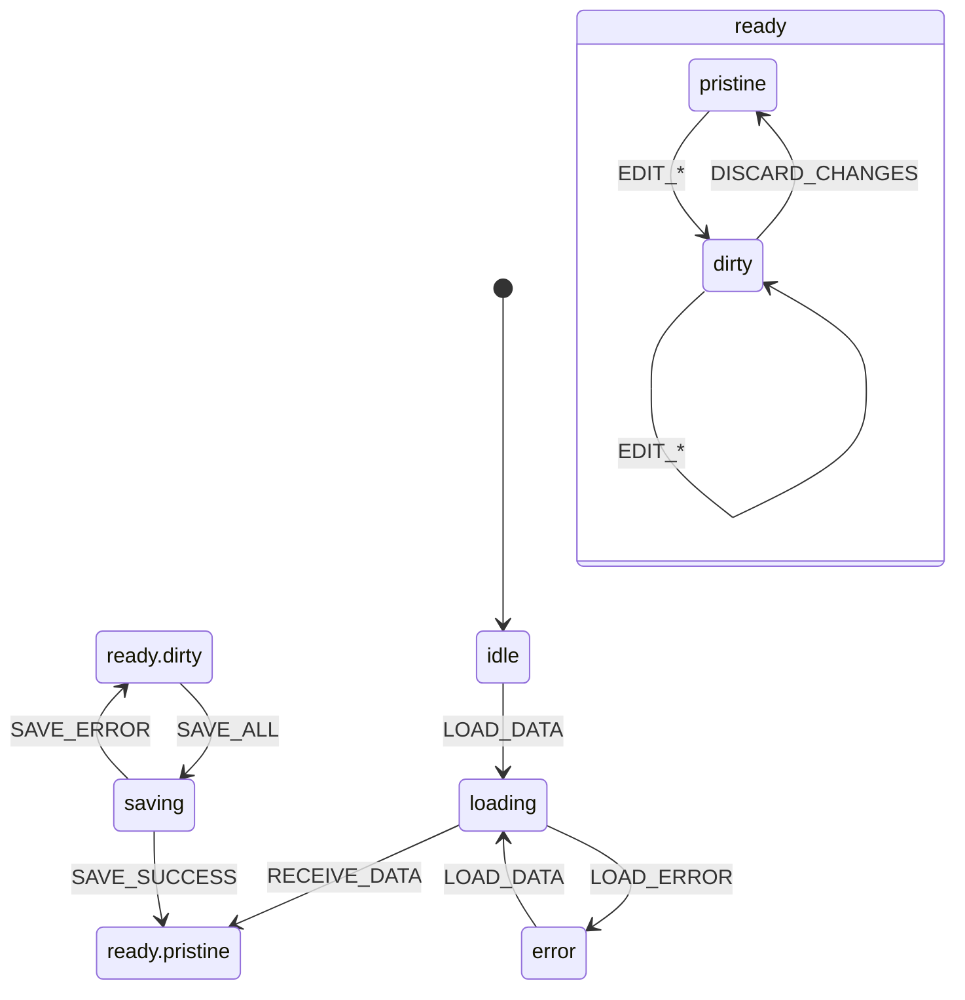

# Guia de State Machines - XState

**Última Atualização:** 20 de Janeiro de 2026  
**Versão XState:** 5.x  
**Versão @xstate/react:** 4.x  
**Status:** ✅ Migração 100% Completa - Products Module

---

## Introdução

Este projeto utiliza XState para gerenciamento de estado complexo. State machines garantem:

- **Estados impossíveis são impossíveis** - Não há como estar em "saving" e "loading" ao mesmo tempo
- **Transições explícitas** - Todas as mudanças de estado são documentadas
- **Debuggability** - Estados são visualizáveis e rastreáveis
- **Type Safety** - TypeScript integral com eventos tipados

---

## Instalação

```bash
npm install xstate@5 @xstate/react@4
```

---

## productFormMachine (Produção)

### Diagrama Visual



### Localização

**Diretório:** `src/modules/products/machines/`

| Arquivo | Responsabilidade |
|---------|-----------------|
| `productFormMachine.ts` | Definição da State Machine |
| `productFormMachine.types.ts` | Contexto, eventos e tipos |
| `productFormMachine.guards.ts` | Guards e helpers de dirty checking |
| `productFormMachine.actions.ts` | Actions e assigns |
| `productFormMachine.actors.ts` | Actors para operações async |
| `index.ts` | Re-exports públicos |

### Estados

| Estado | Descrição |
|--------|-----------|
| `idle` | Aguardando inicialização (productId) |
| `loading` | Carregando dados via BFF `product-full-loader` |
| `ready.pristine` | Dados carregados, sem alterações pendentes |
| `ready.dirty` | Usuário fez alterações não salvas |
| `saving` | Salvando alterações via Save Registry |
| `error` | Erro de carregamento ocorreu |

### Tabela Completa de Eventos

#### Lifecycle Events

| Evento | Payload | Descrição |
|--------|---------|-----------|
| `LOAD_DATA` | `{ productId, userId }` | Inicia carregamento |
| `RECEIVE_DATA` | `MappedProductData` | Dados carregados com sucesso |
| `LOAD_ERROR` | `{ error: string }` | Erro no carregamento |

#### Editing Events

| Evento | Payload | Descrição |
|--------|---------|-----------|
| `EDIT_GENERAL` | `Partial<GeneralFormData>` | Atualiza campos gerais |
| `EDIT_IMAGE` | `{ file?, url?, pendingRemoval? }` | Atualiza estado da imagem |
| `EDIT_OFFERS` | `{ offers, modified }` | Atualiza ofertas |
| `ADD_DELETED_OFFER` | `{ offerId }` | Marca oferta para deleção |
| `EDIT_UPSELL` | `Partial<UpsellSettings>` | Atualiza configurações upsell |
| `EDIT_AFFILIATE` | `Partial<AffiliateSettings>` | Atualiza configurações afiliados |
| `EDIT_CHECKOUT_SETTINGS` | `Partial<CheckoutSettings>` | Atualiza config checkout |
| `INIT_CHECKOUT_SETTINGS` | `CheckoutSettings` | Inicializa config checkout (não marca dirty) |

#### Validation Events

| Evento | Payload | Descrição |
|--------|---------|-----------|
| `SET_VALIDATION_ERROR` | `{ field, message }` | Define erro de validação |
| `CLEAR_VALIDATION_ERRORS` | `{ fields? }` | Limpa erros |
| `SET_TAB_ERRORS` | `{ tabKey, errors }` | Erros por aba |
| `CLEAR_TAB_ERRORS` | `{ tabKey }` | Limpa erros da aba |

#### Action Events

| Evento | Payload | Descrição |
|--------|---------|-----------|
| `SAVE_ALL` | - | Inicia salvamento global |
| `SAVE_SUCCESS` | `{ timestamp }` | Salvamento concluído |
| `SAVE_ERROR` | `{ error }` | Erro no salvamento |
| `DISCARD_CHANGES` | - | Descarta alterações |
| `REFRESH` | - | Recarrega dados do servidor |
| `SET_TAB` | `{ tabKey }` | Navega para aba |

### Actors (Operações Async)

| Actor | Descrição |
|-------|-----------|
| `loadProductActor` | Carrega dados via BFF `product-full-loader` |
| `saveAllActor` | Executa salvamento via Save Registry |

### Context

```typescript
interface ProductFormContext {
  // IDs
  productId: string | null;
  userId: string | null;
  
  // Dados do servidor (snapshot imutável)
  serverData: {
    product: ProductData | null;
    offers: Offer[];
    entities: ProductEntities;
  };
  
  // Dados editados (mutável via eventos)
  editedData: {
    general: GeneralFormData;
    image: ImageFormData;
    offers: Offer[];
    deletedOfferIds: string[];
    offersModified: boolean;
    upsell: UpsellSettings;
    affiliate: AffiliateSettings | null;
    checkoutSettings: CheckoutSettings | null;
  };
  
  // Validação
  validationErrors: ValidationErrors;
  tabErrors: Record<string, TabValidationError[]>;
  
  // Metadata
  currentTab: string;
  lastSavedAt: number | null;
  errorMessage: string | null;
}
```

---

## Integração com ProductContext

```typescript
// ProductContext.tsx
import { useMachine } from "@xstate/react";
import { productFormMachine } from "../machines";

export function ProductProvider({ children, productId }) {
  const { user } = useAuth();
  
  // XState State Machine - Single Source of Truth
  const [state, send] = useMachine(productFormMachine, {
    input: {
      productId,
      userId: user?.id,
    },
  });
  
  // Estado derivado
  const product = state.context.serverData.product;
  const offers = state.context.editedData.offers;
  const isDirty = state.matches("ready.dirty");
  const isSaving = state.matches("saving");
  
  // Actions tipadas
  const updateGeneral = useCallback((data: Partial<GeneralFormData>) => {
    send({ type: "EDIT_GENERAL", ...data });
  }, [send]);
  
  const saveAll = useCallback(async () => {
    send({ type: "SAVE_ALL" });
  }, [send]);
  
  return (
    <ProductContext.Provider value={{
      product,
      offers,
      isDirty,
      isSaving,
      updateGeneral,
      saveAll,
      // ... outras props
    }}>
      {children}
    </ProductContext.Provider>
  );
}
```

### Consumo em Componentes

```typescript
// Qualquer componente filho
function ProductNameField() {
  const { product, updateGeneral, formErrors } = useProductContext();
  
  return (
    <Input
      value={product?.name || ""}
      onChange={(e) => updateGeneral({ name: e.target.value })}
      error={formErrors.name}
    />
  );
}
```

---

## Guards (Dirty Checking)

O arquivo `productFormMachine.guards.ts` contém funções puras para detectar alterações:

```typescript
// Verifica se qualquer seção foi modificada
export function isDirty({ context }: { context: ProductFormContext }): boolean {
  return (
    isGeneralDirty(context) ||
    isImageDirty(context) ||
    isOffersDirty(context) ||
    isUpsellDirty(context) ||
    isAffiliateDirty(context) ||
    isCheckoutSettingsDirty(context)
  );
}

// Flags granulares por seção
export function calculateDirtyFlags(context: ProductFormContext) {
  return {
    general: isGeneralDirty(context),
    image: isImageDirty(context),
    offers: isOffersDirty(context),
    upsell: isUpsellDirty(context),
    affiliate: isAffiliateDirty(context),
    checkoutSettings: isCheckoutSettingsDirty(context),
  };
}

// Guard para permitir salvamento
export function canSave({ context }: { context: ProductFormContext }): boolean {
  return isDirty({ context }) && isValid({ context });
}
```

---

## Best Practices

### 1. Estados como Substantivos

```typescript
// ✅ BOM - estados descrevem "o que é"
states: {
  idle: {},
  loading: {},
  ready: {
    states: {
      pristine: {},
      dirty: {},
    }
  },
  saving: {},
  error: {},
}

// ❌ RUIM - estados como verbos
states: {
  load: {},
  edit: {},
  save: {},
}
```

### 2. Eventos como Ações

```typescript
// ✅ BOM - eventos descrevem "o que aconteceu"
type Events =
  | { type: "LOAD_DATA"; productId: string }
  | { type: "RECEIVE_DATA"; data: ProductData }
  | { type: "EDIT_GENERAL"; name?: string; description?: string }
  | { type: "SAVE_ALL" };

// ❌ RUIM - eventos genéricos
type Events =
  | { type: "UPDATE" }
  | { type: "SET_DATA" };
```

### 3. Contexto Mínimo (Não Derivável)

```typescript
// ✅ BOM - apenas dados necessários
interface Context {
  offers: Offer[];
  deletedOfferIds: string[];
}

// ❌ RUIM - dados deriváveis
interface Context {
  offers: Offer[];
  offerCount: number;      // Derivável: offers.length
  hasOffers: boolean;      // Derivável: offers.length > 0
  activeOffers: Offer[];   // Derivável: offers.filter(o => o.status === 'active')
}
```

### 4. Actors para Side Effects

```typescript
// ✅ BOM - operações async em actors
const loadProductActor = fromPromise(async ({ input }) => {
  const response = await api.call("product-full-loader", { productId: input.productId });
  return mapFullData(response);
});

// Na máquina:
loading: {
  invoke: {
    src: loadProductActor,
    input: ({ context }) => ({ productId: context.productId }),
    onDone: { target: "ready.pristine", actions: "assignServerData" },
    onError: { target: "error", actions: "assignError" },
  },
},
```

---

## Debugging

### Console Logging

```typescript
// Em desenvolvimento
import { useEffect } from "react";

function useDebugMachine() {
  const [state] = useMachine(productFormMachine);
  
  useEffect(() => {
    if (import.meta.env.DEV) {
      console.log("[XState]", state.value, state.context);
    }
  }, [state]);
}
```

### XState Inspector (Opcional)

```typescript
import { inspect } from "@xstate/inspect";

if (import.meta.env.DEV) {
  inspect({ iframe: false });
}
```

---

## Recursos

- [XState Documentation](https://stately.ai/docs)
- [XState Visualizer](https://stately.ai/viz)
- [XState TypeScript Guide](https://stately.ai/docs/typescript)

---

## Changelog

| Data | Alteração |
|------|-----------|
| 2026-01-17 | Criação da estrutura XState |
| 2026-01-17 | Documentação inicial |
| 2026-01-20 | **MIGRAÇÃO COMPLETA PARA XSTATE** |
| 2026-01-20 | Adicionado diagrama Mermaid |
| 2026-01-20 | Tabela completa de eventos |
| 2026-01-20 | Documentação de Actors |
| 2026-01-20 | Integração com ProductContext |
| 2026-01-20 | Guards de dirty checking |
