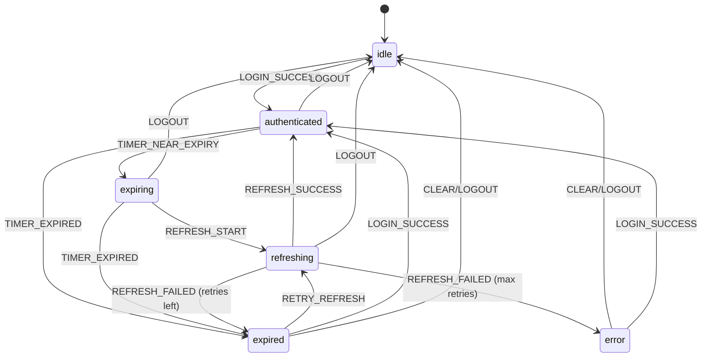

# Token Lifecycle FSM - Arquitetura Técnica

> **Versão:** 1.0.0  
> **Data:** 19 de Janeiro de 2026  
> **Status:** RISE Protocol V3 Compliant (10.0/10)  
> **Módulo:** `src/lib/token-manager/`

---

## 1. Visão Geral

O Token Manager implementa uma **Máquina de Estados Finitos (FSM)** determinística para gerenciar o ciclo de vida de tokens de autenticação. O sistema é dividido em módulos com responsabilidades únicas, garantindo manutenibilidade e testabilidade.

### 1.1 Princípios Arquiteturais

| Princípio | Implementação |
|-----------|---------------|
| **Single Responsibility** | Cada módulo tem uma única responsabilidade |
| **Determinismo** | Todas as transições são explícitas e previsíveis |
| **Zero Side Effects** | A função `transition()` é pura |
| **Type Safety** | Discriminated unions para estados e eventos |
| **Fail-Safe** | Estados de erro com recovery paths |

---

## 2. Estrutura de Módulos

```
src/lib/token-manager/
├── types.ts          # Tipos, constantes e interfaces
├── machine.ts        # FSM pura (transições de estado)
├── persistence.ts    # Operações localStorage
├── heartbeat.ts      # Timer de verificação proativa
├── refresh.ts        # Comunicação HTTP com backend
├── service.ts        # Orquestrador principal
└── index.ts          # Exports públicos
```

### 2.1 Responsabilidades por Módulo

| Módulo | Responsabilidade | Linhas |
|--------|------------------|--------|
| `types.ts` | Definições de tipos, estados, eventos e constantes | ~150 |
| `machine.ts` | Função de transição pura da FSM | ~273 |
| `persistence.ts` | Leitura/escrita no localStorage | ~89 |
| `heartbeat.ts` | Gerenciamento de timer periódico | ~82 |
| `refresh.ts` | Requisições HTTP para refresh de tokens | ~74 |
| `service.ts` | Orquestração e API pública | ~210 |
| `index.ts` | Re-exports e instâncias singleton | ~57 |

> **⚠️ NOTA IMPORTANTE (2026-01-27 - Session Commander V3):**  
> O `persistence.ts` gerencia apenas **metadados de estado da FSM** (ex: `lastRefresh`, `expiresAt`), **não os tokens em si**.  
> Os tokens de sessão são armazenados em **cookies httpOnly** (`__Secure-rise_access` / `__Secure-rise_refresh`),  
> inacessíveis via JavaScript, protegendo contra XSS. O browser envia os cookies automaticamente em cada requisição.

---

## 3. Diagrama da FSM



---

## 4. Estados

### 4.1 Definição de Estados

```typescript
type TokenState = 
  | "idle"          // Não autenticado
  | "authenticated" // Token válido
  | "expiring"      // Token próximo de expirar
  | "refreshing"    // Refresh em progresso
  | "expired"       // Token expirado
  | "error";        // Erro irrecuperável
```

### 4.2 Semântica dos Estados

| Estado | Descrição | Permite API Calls? |
|--------|-----------|-------------------|
| `idle` | Usuário não autenticado | ❌ |
| `authenticated` | Token válido e ativo | ✅ |
| `expiring` | Token válido mas próximo de expirar | ✅ |
| `refreshing` | Refresh em andamento | ✅ |
| `expired` | Token expirou, aguardando retry | ❌ |
| `error` | Falhas máximas atingidas | ❌ |

---

## 5. Eventos

### 5.1 Definição de Eventos

```typescript
type TokenEvent =
  | { type: "LOGIN_SUCCESS"; expiresIn: number }
  | { type: "LOGOUT" }
  | { type: "TIMER_NEAR_EXPIRY" }
  | { type: "TIMER_EXPIRED" }
  | { type: "REFRESH_START" }
  | { type: "REFRESH_SUCCESS"; expiresIn: number }
  | { type: "REFRESH_FAILED"; error: string }
  | { type: "RETRY_REFRESH" }
  | { type: "CLEAR" };
```

### 5.2 Origem dos Eventos

| Evento | Origem | Trigger |
|--------|--------|---------|
| `LOGIN_SUCCESS` | `TokenService.setAuthenticated()` | Login bem-sucedido |
| `LOGOUT` | `TokenService.clearTokens()` | Logout do usuário |
| `TIMER_NEAR_EXPIRY` | `HeartbeatManager` | Token a 5min de expirar |
| `TIMER_EXPIRED` | `HeartbeatManager` | Token expirou |
| `REFRESH_START` | `TokenService.refresh()` | Início do refresh |
| `REFRESH_SUCCESS` | `executeRefresh()` | Backend retornou sucesso |
| `REFRESH_FAILED` | `executeRefresh()` | Backend retornou erro |
| `RETRY_REFRESH` | `TokenService` | Retry automático |
| `CLEAR` | `TokenService.clearTokens()` | Reset completo |

---

## 6. Contexto Estendido

O contexto persiste dados entre transições:

```typescript
interface TokenContext {
  expiresAt: number | null;        // Timestamp de expiração
  lastRefreshAttempt: number | null; // Última tentativa de refresh
  errorMessage: string | null;      // Mensagem de erro atual
  refreshFailureCount: number;      // Contador de falhas
}
```

---

## 7. Constantes de Timing

```typescript
const TOKEN_TIMING = {
  REFRESH_THRESHOLD_MS: 5 * 60 * 1000,    // 5 minutos antes de expirar
  REFRESH_TIMEOUT_MS: 30 * 1000,          // Timeout de 30s para refresh
  HEARTBEAT_INTERVAL_MS: 60 * 1000,       // Verificação a cada 1 minuto
  MAX_REFRESH_FAILURES: 3,                // Máximo de 3 tentativas
};
```

---

## 8. Exemplos de Uso

### 8.1 Login Flow

```typescript
import { unifiedTokenService } from "@/lib/token-manager";

// Após login bem-sucedido no backend
const loginResponse = await fetch("/functions/v1/unified-auth/login", {
  method: "POST",
  credentials: "include",
  body: JSON.stringify({ email, password }),
});

const data = await loginResponse.json();

if (data.success) {
  // Notifica o TokenService sobre o novo token
  unifiedTokenService.setAuthenticated(data.expiresIn);
}
```

### 8.2 Verificar Estado

```typescript
import { unifiedTokenService } from "@/lib/token-manager";

// Verificar se tem token válido
if (unifiedTokenService.hasValidToken()) {
  // Pode fazer chamadas autenticadas
}

// Obter estado atual
const state = unifiedTokenService.getState();
// "idle" | "authenticated" | "expiring" | "refreshing" | "expired" | "error"
```

### 8.3 Subscribe a Mudanças

```typescript
import { unifiedTokenService } from "@/lib/token-manager";
import { useEffect, useState } from "react";

function useTokenState() {
  const [state, setState] = useState(unifiedTokenService.getState());
  
  useEffect(() => {
    const unsubscribe = unifiedTokenService.subscribe((newState) => {
      setState(newState);
    });
    
    return unsubscribe;
  }, []);
  
  return state;
}
```

### 8.4 Refresh Manual

```typescript
import { unifiedTokenService } from "@/lib/token-manager";

// Forçar refresh (útil antes de operações críticas)
const success = await unifiedTokenService.refresh();

if (!success) {
  // Redirecionar para login
  navigate("/login");
}
```

### 8.5 Logout

```typescript
import { unifiedTokenService } from "@/lib/token-manager";

async function handleLogout() {
  // Backend invalida a sessão
  await fetch("/functions/v1/unified-auth/logout", {
    method: "POST",
    credentials: "include",
  });
  
  // Limpa estado local
  unifiedTokenService.clearTokens();
  
  // Redireciona
  navigate("/login");
}
```

---

## 9. Integração com API Client

O `api-client.ts` integra automaticamente com o TokenService:

```typescript
// src/lib/api/client.ts
import { unifiedTokenService } from "@/lib/token-manager";

async function authenticatedFetch(url: string, options: RequestInit) {
  // Verifica estado antes da chamada
  if (!unifiedTokenService.hasValidToken()) {
    throw new Error("Not authenticated");
  }
  
  const response = await fetch(url, {
    ...options,
    credentials: "include", // Cookies httpOnly
  });
  
  // Se 401, tenta refresh automático
  if (response.status === 401) {
    const refreshed = await unifiedTokenService.refresh();
    
    if (refreshed) {
      // Retry da requisição original
      return fetch(url, { ...options, credentials: "include" });
    }
    
    // Refresh falhou, limpa tokens
    unifiedTokenService.clearTokens();
    throw new Error("Session expired");
  }
  
  return response;
}
```

---

## 10. Persistência

### 10.1 Tokens em Cookies httpOnly (Primário)

Os tokens de sessão são armazenados em **cookies httpOnly** gerenciados pelo backend:

| Cookie | Descrição |
|--------|-----------|
| `__Secure-rise_access` | Token de acesso unificado (4h, Domain=.risecheckout.com) |
| `__Secure-rise_refresh` | Refresh token unificado (30 dias, Domain=.risecheckout.com) |

> **IMPORTANTE:** O JavaScript **NÃO** tem acesso aos tokens (proteção XSS total).
> O TokenService gerencia apenas o **estado da FSM**, não os tokens em si.
> 
> **RISE V3:** Os cookies legados (`__Host-producer_*`, `__Host-buyer_*`) foram eliminados.

### 10.2 Estado da FSM no localStorage

O TokenService persiste apenas metadados (não tokens) para restaurar estado entre reloads:

```typescript
// Metadados (NÃO contêm tokens)
"rise_producer_token_state"      // Estado atual da FSM
"rise_producer_token_expires"    // Timestamp de expiração estimado
"rise_producer_last_refresh"     // Última tentativa de refresh
```

### 10.3 Restauração no Boot

```typescript
// Acontece automaticamente no constructor do TokenService
constructor(type: TokenType) {
  this.restoreState(); // Lê metadados e reconstrói estado da FSM
  this.heartbeat.start(); // Inicia verificação periódica
}
```

---

## 11. Segurança

### 11.1 Proteções Implementadas

| Proteção | Implementação |
|----------|---------------|
| **XSS** | Tokens em httpOnly cookies (nunca em JS) |
| **CSRF** | SameSite=None + Partitioned cookies |
| **Token Theft** | Rotação em cada refresh |
| **Replay Attack** | Detecção de reuso de refresh token |
| **Brute Force** | Rate limiting no backend |

### 11.2 Fluxo de Cookies

```
┌─────────────┐                    ┌─────────────┐
│   Browser   │                    │   Backend   │
└─────────────┘                    └─────────────┘
       │                                  │
       │  POST /login                     │
       │  (email, password)               │
       │ ──────────────────────────────►  │
       │                                  │
       │  Set-Cookie: __Host-session=...  │
       │  Set-Cookie: __Host-refresh=...  │
       │  { success: true, expiresIn: 900 }│
       │ ◄──────────────────────────────  │
       │                                  │
       │  POST /api/data                  │
       │  Cookie: __Host-session=...      │
       │ ──────────────────────────────►  │
       │                                  │
```

---

## 12. Debugging

### 12.1 Logs

O módulo usa o logger centralizado:

```typescript
import { createLogger } from "@/lib/logger";

const log = createLogger("TokenService");
log.debug("State transition", { from: "idle", to: "authenticated" });
log.info("Token refreshed", { expiresIn: 900 });
log.warn("Refresh failed", { attempt: 2, maxAttempts: 3 });
log.error("Max retries exceeded", { state: "error" });
```

### 12.2 Inspecionar Estado

```typescript
import { unifiedTokenService } from "@/lib/token-manager";
import { createLogger } from "@/lib/logger";

const log = createLogger("TokenDebug");

log.debug("Token state inspection", {
  state: unifiedTokenService.getState(),
  hasValidToken: unifiedTokenService.hasValidToken(),
});
```

---

## 13. Manutenção

### 13.1 Adicionar Novo Estado

1. Adicionar ao type `TokenState` em `types.ts`
2. Adicionar transições em `machine.ts`
3. Atualizar `canMakeApiCalls()` se necessário
4. Atualizar este documento

### 13.2 Adicionar Novo Evento

1. Adicionar ao type `TokenEvent` em `types.ts`
2. Adicionar handlers nos estados relevantes em `machine.ts`
3. Criar dispatch point no `service.ts`
4. Atualizar este documento

### 13.3 Modificar Timing

Alterar constantes em `types.ts`:

```typescript
export const TOKEN_TIMING = {
  REFRESH_THRESHOLD_MS: 5 * 60 * 1000,  // Alterar aqui
  // ...
};
```

### 13.4 Checklist de Mudanças

- [ ] Todos os arquivos < 300 linhas?
- [ ] Tipos atualizados em `types.ts`?
- [ ] Transições explícitas em `machine.ts`?
- [ ] Documentação atualizada?
- [ ] Testes passando?

---

## 14. Troubleshooting

### 14.1 Token Não Persiste

**Sintoma:** Usuário perde sessão ao recarregar página.

**Causas Possíveis:**
1. Cookies de terceiros bloqueados pelo browser
2. Estado da FSM não restaurado corretamente
3. Cookie httpOnly expirou no backend

**Debug:**
```typescript
import { createLogger } from "@/lib/logger";
const log = createLogger("TokenDebug");

// Verificar estado da FSM (metadados, não tokens)
log.debug("Token state:", localStorage.getItem("rise_unified_token_state"));

// Verificar estado do serviço (RISE V3: unifiedTokenService)
log.debug("Service state:", unifiedTokenService.getState());
```

> **Nota:** Não é possível verificar os cookies httpOnly via JavaScript (isso é intencional - proteção XSS).

### 14.2 Refresh Loop Infinito

**Sintoma:** Múltiplas requisições de refresh em sequência.

**Causas Possíveis:**
1. Backend retornando 401 no refresh
2. Heartbeat muito agressivo
3. Cookie não sendo enviado

**Debug:**
```typescript
// Verificar contador de falhas
// (requer acesso ao estado interno - apenas para debug)
```

### 14.3 Estado "error" Permanente

**Sintoma:** Usuário preso em estado de erro.

**Solução:**
```typescript
// Forçar logout e limpar estado
producerTokenService.clearTokens();
// Redirecionar para login
```

---

## 15. Referências

- [RISE Protocol V3](./RISE_PROTOCOL_V3.md)
- [Authentication System](./AUTHENTICATION_SYSTEM.md)
- [Coding Standards](./CODING_STANDARDS.md)
- [XState Documentation](https://stately.ai/docs/xstate)

---

## Changelog

| Versão | Data | Alterações |
|--------|------|------------|
| 1.0.0 | 2026-01-19 | Documentação inicial após modularização |

---

**FIM DA DOCUMENTAÇÃO**
