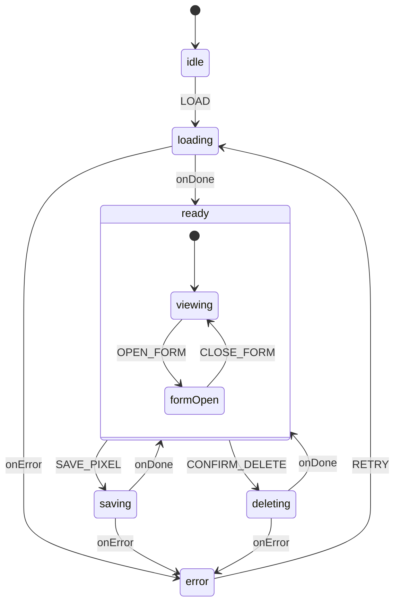
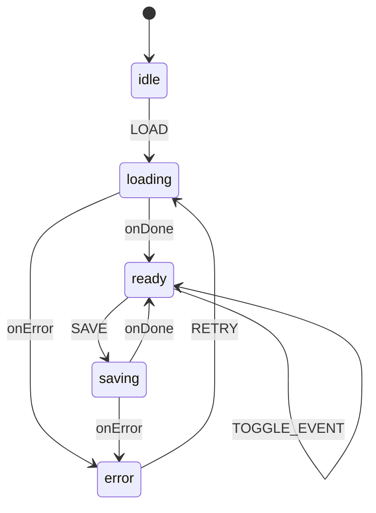

# Módulo de Trackeamento - RiseCheckout

**Versão:** 1.0.0  
**Data:** 21 de Janeiro de 2026  
**Status:** ✅ ATIVO - PRODUÇÃO  
**RISE V3 Score:** 10.0/10

---

## 1. Visão Geral

O Módulo de Trackeamento é o sistema unificado para gerenciamento de pixels de rastreamento e integrações de analytics. Consolida duas funcionalidades principais:

1. **Pixels** - Gerenciamento de pixels de plataformas de anúncios (Facebook, TikTok, Google Ads, Kwai)
2. **UTMify** - Integração com a plataforma UTMify para tracking de conversões

### Navegação

- **Rota:** `/dashboard/trackeamento`
- **Tabs:** Pixels | UTMify
- **Grupo de Navegação:** Configurações

---

## 2. Arquitetura

### 2.1 Estrutura de Módulos

```
src/
├── modules/
│   ├── pixels/                    # Módulo de Pixels (XState SSOT)
│   │   ├── machines/              
│   │   │   ├── pixelsMachine.ts   # State Machine principal
│   │   │   └── index.ts           
│   │   ├── context/               
│   │   │   ├── PixelsContext.tsx  # Provider + hook
│   │   │   └── index.ts           
│   │   ├── components/            
│   │   │   ├── PixelLibrary.tsx   # Lista de pixels
│   │   │   ├── PixelCard.tsx      # Card individual
│   │   │   ├── PixelForm.tsx      # Formulário CRUD
│   │   │   └── index.ts           
│   │   └── types.ts               
│   │
│   └── utmify/                    # Módulo UTMify (XState SSOT)
│       ├── machines/              
│       │   ├── utmifyMachine.ts   # State Machine principal
│       │   ├── utmifyMachine.types.ts
│       │   └── index.ts           
│       ├── context/               
│       │   ├── UTMifyContext.tsx  # Provider + hook
│       │   └── index.ts           
│       ├── components/            
│       │   ├── UTMifyForm.tsx     # Container principal
│       │   ├── TokenInput.tsx     # Input do API token
│       │   ├── ProductSelector.tsx # Seletor de produtos
│       │   ├── EventSelector.tsx  # Seletor de eventos
│       │   └── index.ts           
│       ├── constants/             
│       │   ├── events.ts          # UTMIFY_EVENTS
│       │   └── index.ts           
│       ├── types.ts               
│       └── index.ts               
│
├── integrations/tracking/         # Módulos de disparo por plataforma
│   ├── facebook/                  
│   ├── tiktok/                    
│   ├── google-ads/                
│   ├── kwai/                      
│   └── utmify/                    
│
└── pages/
    ├── Rastreamento.tsx           # Página principal (Tabs)
    └── Webhooks.tsx               # Página de webhooks (separada)
```

### 2.2 Diagrama de Camadas

```
┌─────────────────────────────────────────────────────────────────────────┐
│                        CAMADA DE APRESENTAÇÃO                            │
├─────────────────────────────────────────────────────────────────────────┤
│  Rastreamento.tsx   │   PixelLibrary   │   UTMifyForm   │   Webhooks   │
│  (Tabs Container)   │   (Lista CRUD)   │   (Config UI)  │   (CRUD)     │
└────────────────────────────────┬────────────────────────────────────────┘
                                 │
                                 ▼
┌─────────────────────────────────────────────────────────────────────────┐
│                        CAMADA DE ESTADO (XState)                         │
├─────────────────────────────────────────────────────────────────────────┤
│  PixelsContext          │   UTMifyContext         │   WebhooksContext   │
│  ├─ pixelsMachine       │   ├─ utmifyMachine      │   ├─ webhooksMachine│
│  └─ usePixels()         │   └─ useUTMifyContext() │   └─ useWebhooks()  │
└────────────────────────────────┬────────────────────────────────────────┘
                                 │
                                 ▼
┌─────────────────────────────────────────────────────────────────────────┐
│                        CAMADA DE TRACKING                                │
├─────────────────────────────────────────────────────────────────────────┤
│  Facebook.Pixel   │   TikTok.Pixel   │   GoogleAds.Tracker   │   Kwai   │
│  Facebook.trackPurchase()            │   TikTok.trackPurchase()         │
└────────────────────────────────┬────────────────────────────────────────┘
                                 │
                                 ▼
┌─────────────────────────────────────────────────────────────────────────┐
│                        CAMADA DE PERSISTÊNCIA                            │
├─────────────────────────────────────────────────────────────────────────┤
│  vendor_pixels   │   product_pixels   │   vendor_integrations (UTMify)  │
└─────────────────────────────────────────────────────────────────────────┘
```

---

## 3. State Machines (XState)

### 3.1 PixelsMachine



**Estados:**
- `idle` - Estado inicial
- `loading` - Carregando pixels do backend
- `ready.viewing` - Exibindo lista de pixels
- `ready.formOpen` - Formulário aberto (criar/editar)
- `saving` - Salvando pixel
- `deleting` - Deletando pixel
- `error` - Estado de erro

**Eventos:**
- `LOAD` - Carregar pixels
- `OPEN_FORM` - Abrir formulário
- `CLOSE_FORM` - Fechar formulário
- `SAVE_PIXEL` - Salvar pixel
- `CONFIRM_DELETE` - Confirmar exclusão
- `RETRY` - Tentar novamente

---

### 3.2 UTMifyMachine



**Estados:**
- `idle` - Estado inicial
- `loading` - Carregando configuração
- `ready` - Pronto para interação
- `saving` - Salvando configuração
- `error` - Estado de erro

**Eventos:**
- `LOAD` - Carregar configuração
- `UPDATE_TOKEN` - Atualizar API token
- `TOGGLE_ACTIVE` - Ativar/desativar integração
- `TOGGLE_PRODUCT` - Selecionar/deselecionar produto
- `TOGGLE_EVENT` - Selecionar/deselecionar evento
- `SAVE` - Salvar configuração
- `RESET` - Resetar para idle

---

## 4. Plataformas Suportadas

### 4.1 Pixels de Anúncios

| Plataforma | Script Global | Evento de Compra | Conversions API | Status |
|------------|---------------|------------------|-----------------|--------|
| Facebook   | `fbq`         | Purchase         | ✅ Sim          | ✅ Ativo |
| TikTok     | `ttq`         | CompletePayment  | ✅ Sim          | ✅ Ativo |
| Google Ads | `gtag`        | conversion       | ❌ Não          | ✅ Ativo |
| Kwai       | `kwaiq`       | PlaceOrder       | ❌ Não          | ✅ Ativo |

### 4.2 UTMify

| Funcionalidade | Descrição | Status |
|----------------|-----------|--------|
| Conversões | Tracking de vendas aprovadas | ✅ Ativo |
| Atribuição | `src`, `sck`, UTM params | ✅ Ativo |
| Produtos | Seleção por produto | ✅ Ativo |
| Eventos | Seleção de eventos para disparar | ✅ Ativo |

---

## 5. Modelo de Dados

### 5.1 Tabela `vendor_pixels`

```sql
CREATE TABLE vendor_pixels (
  id UUID PRIMARY KEY DEFAULT gen_random_uuid(),
  vendor_id UUID NOT NULL REFERENCES auth.users,
  platform TEXT NOT NULL, -- facebook, tiktok, google_ads, kwai
  name TEXT NOT NULL,
  pixel_id TEXT NOT NULL,
  access_token TEXT,      -- Para Conversions API
  conversion_label TEXT,  -- Google Ads only
  domain TEXT,            -- Facebook only
  is_active BOOLEAN DEFAULT true,
  created_at TIMESTAMPTZ DEFAULT now(),
  updated_at TIMESTAMPTZ DEFAULT now()
);
```

### 5.2 Tabela `product_pixels`

```sql
CREATE TABLE product_pixels (
  id UUID PRIMARY KEY DEFAULT gen_random_uuid(),
  product_id UUID NOT NULL REFERENCES products,
  pixel_id UUID NOT NULL REFERENCES vendor_pixels,
  fire_on_initiate_checkout BOOLEAN DEFAULT true,
  fire_on_purchase BOOLEAN DEFAULT true,
  fire_on_pix BOOLEAN DEFAULT true,
  fire_on_card BOOLEAN DEFAULT true,
  fire_on_boleto BOOLEAN DEFAULT true,
  custom_value_percent INTEGER DEFAULT 100,
  created_at TIMESTAMPTZ DEFAULT now()
);
```

### 5.3 Tabela `vendor_integrations` (UTMify)

```sql
CREATE TABLE vendor_integrations (
  id UUID PRIMARY KEY DEFAULT gen_random_uuid(),
  vendor_id UUID NOT NULL REFERENCES auth.users,
  integration_type TEXT NOT NULL, -- 'UTMIFY'
  config JSONB NOT NULL DEFAULT '{}',
  is_active BOOLEAN DEFAULT true,
  created_at TIMESTAMPTZ DEFAULT now(),
  updated_at TIMESTAMPTZ DEFAULT now()
);
```

**Exemplo de config UTMify:**
```json
{
  "api_token": "utmify_abc123xyz",
  "selected_products": ["uuid-1", "uuid-2"],
  "selected_events": ["purchase", "lead"]
}
```

---

## 6. Fluxo de Disparo (Checkout)

```
┌─────────────────────────────────────────────────────────────────────────┐
│                     FLUXO: DISPARO DE CONVERSÃO                          │
├─────────────────────────────────────────────────────────────────────────┤
│                                                                          │
│  1. CHECKOUT CARREGA                                                     │
│     │                                                                    │
│     ▼                                                                    │
│  ┌─────────────────────────────────────────┐                             │
│  │ checkout-loader (Edge Function)         │                             │
│  │ → Retorna productPixels[] vinculados    │                             │
│  └────────────────┬────────────────────────┘                             │
│                   │                                                      │
│  2. INJETA SCRIPTS                                                       │
│     │                                                                    │
│     ▼                                                                    │
│  ┌─────────────────────────────────────────┐                             │
│  │ TrackingManager.tsx                     │                             │
│  │ → Filtra por plataforma                 │                             │
│  │ → Renderiza Facebook.Pixel, TikTok.Pixel│                             │
│  └────────────────┬────────────────────────┘                             │
│                   │                                                      │
│  3. PAGAMENTO CONFIRMADO                                                 │
│     │                                                                    │
│     ▼                                                                    │
│  ┌─────────────────────────────────────────┐                             │
│  │ Webhook do gateway → order.status=paid  │                             │
│  └────────────────┬────────────────────────┘                             │
│                   │                                                      │
│  4. DISPARA EVENTOS                                                      │
│     │                                                                    │
│     ▼                                                                    │
│  ┌─────────────────────────────────────────┐                             │
│  │ Facebook.trackPurchase()                │                             │
│  │ TikTok.trackPurchase()                  │                             │
│  │ GoogleAds.trackPurchase()               │                             │
│  │ Kwai.trackPurchase()                    │                             │
│  │ UTMify → forward-to-utmify (backend)    │                             │
│  └─────────────────────────────────────────┘                             │
│                                                                          │
└─────────────────────────────────────────────────────────────────────────┘
```

---

## 7. Conformidade RISE V3

| Critério | Status | Evidência |
|----------|--------|-----------|
| Limite 300 linhas | ✅ | Todos arquivos < 250 linhas |
| XState como SSOT | ✅ | `pixelsMachine`, `utmifyMachine` |
| Zero `any` types | ✅ | TypeScript strict mode |
| Zero `console.log` | ✅ | Usa `createLogger()` |
| Zero `@ts-ignore` | ✅ | Verificado via grep |
| Single Responsibility | ✅ | Componentes focados |
| Backend-Only Mutations | ✅ | Via Edge Functions |
| Documentação atualizada | ✅ | Este documento |

---

## 8. Documentação Relacionada

- **[PIXEL_SYSTEM.md](./PIXEL_SYSTEM.md)** - Detalhes técnicos do sistema de pixels
- **[XSTATE_ARCHITECTURE.md](./XSTATE_ARCHITECTURE.md)** - Arquitetura XState do projeto
- **[SIDEBAR_ARCHITECTURE.md](./SIDEBAR_ARCHITECTURE.md)** - Navegação e rotas

### Arquivos Históricos (Arquivados)

- `docs/archive/2026-01/UTMIFY_INTEGRATION.md` - Documentação v1
- `docs/archive/2026-01/UTMIFY_V2_FINAL.md` - Documentação v2
- `docs/archive/2026-01/UTMIFY_INTEGRATION_CORRECTED.md` - Correções v2

---

## 9. Changelog

| Data | Versão | Alteração |
|------|--------|-----------|
| 2026-01-21 | 1.1.0 | Refatoração RISE V3: removido import não utilizado, substituído ícone deprecated, centralizado save no XState |
| 2026-01-21 | 1.0.0 | Criação do documento (consolidação Pixels + UTMify) |

---

**Desenvolvido seguindo o RISE Architect Protocol V3 (Score: 10.0/10)**
