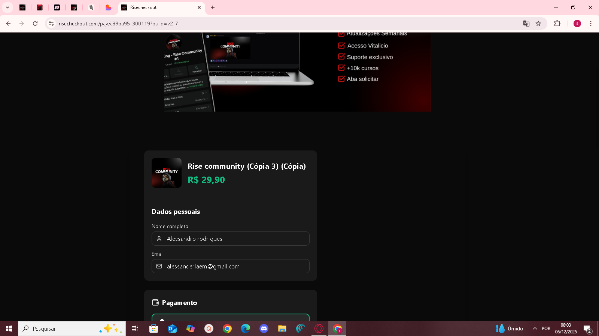

> **📅 DOCUMENTO HISTÓRICO**  
> Este documento foi criado em 06/12/2025.  
> Algumas informações técnicas podem estar desatualizadas.  
> Para a arquitetura atual, consulte `docs/ARCHITECTURE.md` e `docs/STATUS_ATUAL.md`.

# Relatório Comparativo de Checkouts: RiseCheckout vs. Mercado

**Autor**: Manus AI
**Data**: 06 de Dezembro de 2025
**Versão**: 1.0

## 🎯 Objetivo

Este relatório apresenta uma análise profunda e comparativa entre o **RiseCheckout** e cinco dos principais players do mercado de infoprodutos no Brasil: **Kiwify, Hotmart, Ticto, Cakto e Kirvano**. O objetivo é identificar padrões de design, arquitetura de informação, UX e especificações técnicas para fornecer um plano de ação claro e data-driven para a evolução do RiseCheckout, alinhando-o com as melhores práticas do mercado.

---

## 📊 Análise Comparativa dos Concorrentes

A análise foi dividida por plataforma, focando em layout, estrutura, hierarquia visual e características únicas, com base em pesquisa de mercado e análise de screenshots reais.

### Tabela Resumo: Padrões de Layout

| Plataforma | Layout Predominante | Largura Média (Desktop) | Foco Principal |
| :--- | :--- | :--- | :--- |
| **Kiwify** | 1 Coluna | 800-900px | Minimalismo e Conversão |
| **Hotmart** | 2 Colunas (com sidebar) | 1100-1200px | Riqueza de Informações |
| **Ticto** | 1 Coluna | 850-900px | Design Moderno e UX |
| **Cakto** | 1 Coluna | 800-850px | Velocidade e Simplicidade |
| **Kirvano** | 2 Colunas (com sidebar) | 1100px | Corporativo e Profissional |

### 1. Kiwify: O Padrão Minimalista

O Kiwify é a principal referência para o design de 1 coluna. Seu checkout é limpo, direto e otimizado para conversão, com alto contraste (geralmente fundo escuro e card de formulário claro).

- **Hierarquia Visual**: A ordem é rigorosa: Produto > Dados Pessoais > Pagamento > Order Bumps > Resumo > Botão de Compra.
- **Destaques**: O preço do produto e o botão de compra são os elementos com maior peso visual, utilizando cores vibrantes (principalmente verde) e fontes grandes.
- **Espaçamento**: Generoso, evitando qualquer sensação de aperto e guiando o olhar do usuário de forma fluida.

### 2. Hotmart: O Padrão Informativo

A Hotmart adota um layout de 2 colunas, com uma sidebar fixa à direita que exibe um resumo detalhado do pedido. Essa abordagem aproveita melhor o espaço de telas maiores e mantém as informações da compra sempre visíveis.

- **Sidebar**: É o grande diferencial. Contém imagem do produto, descrição, lista de benefícios, garantia e selos de segurança, funcionando como um reforço constante do valor da oferta.
- **Cores**: Mais corporativas, com laranja e azul sendo as cores de ação primárias.

### 3. Ticto: O Padrão Moderno

Similar ao Kiwify no layout de 1 coluna, o Ticto se diferencia pela modernidade e foco em micro-interações.

- **Progress Bar**: Um indicador de progresso no topo da página guia o usuário pelas etapas (Dados, Pagamento, etc.), melhorando a previsibilidade.
- **Animações**: Inputs com labels flutuantes e transições suaves tornam a experiência mais agradável e polida.

### 4. Cakto & Kirvano

- **Cakto**: Segue a linha do Kiwify, focando em simplicidade e velocidade de carregamento, sendo ainda mais minimalista.
- **Kirvano**: Adota o layout de 2 colunas como a Hotmart, com uma estética mais corporativa e cores como roxo e rosa.

---

## 🎨 Padrões de Design e UX Identificados

A análise revela um "manual de boas práticas" seguido por todos os players de sucesso.

### Tabela de Especificações Técnicas (Valores Médios)

| Elemento | Altura | Padding | Font Size | Font Weight | Border Radius |
| :--- | :--- | :--- | :--- | :--- | :--- |
| **Input de Formulário** | 52px | 12px 16px | 16px | 400 | 8px |
| **Botão Principal** | 60px | 16px 24px | 18px | 600-700 | 8px |
| **Botão de Pagamento** | 54px | 12px 16px | 16px | 500 | 8px |
| **Título do Produto** | N/A | N/A | 24-28px | 700 | N/A |
| **Preço do Produto** | N/A | N/A | 32-36px | 700 | N/A |

### Insights Chave

1.  **Espaçamento é Rei**: Todos os checkouts de alta conversão utilizam espaçamentos generosos. O padding interno dos cards é de `28-32px` e o espaçamento entre seções principais é de `32-40px`.

2.  **Verde para Conversão**: A cor verde (`#10b981` ou similar) é quase um padrão universal para o botão de compra principal e para a seleção do método PIX, psicologicamente associada a "seguro" e "avançar".

3.  **Hierarquia Visual Clara**: A informação mais importante (preço) é a maior e mais destacada. O botão de ação principal é o segundo elemento de maior peso.

4.  **Confiança é Fundamental**: Ícones de cadeado, selos de segurança (SSL, Compra Segura) e logos de bandeiras de cartão são onipresentes e essenciais para reduzir a ansiedade do comprador.

5.  **Foco no Essencial**: A página de checkout é livre de distrações. Não há links de navegação externos, menus ou qualquer elemento que possa desviar o usuário do objetivo final: a compra.

---

## 🚀 Diagnóstico e Plano de Ação para o RiseCheckout

Com base na análise comparativa, o RiseCheckout já possui uma base sólida, mas precisa de refinamentos específicos para atingir o nível de excelência do mercado.

### Diagnóstico Atual

-   ✅ **Estrutura Correta**: A decisão de usar 1 coluna está alinhada com a tendência moderna de foco e simplicidade (Kiwify, Ticto).
-   ✅ **Base Funcional**: Os componentes essenciais (produto, formulário, pagamento, etc.) já existem.
-   ⚠️ **Pontos de Melhoria**: Os principais gaps estão nos **espaçamentos, hierarquia visual e dimensionamento** dos elementos interativos.

### Plano de Ação Recomendado

Este plano é dividido em fases, da mais crítica para a de menor prioridade, permitindo melhorias incrementais e rápidas.

#### Fase 1: Fundações de Layout e Espaçamento (Prioridade Alta)
**Objetivo**: Corrigir os problemas mais críticos de layout que afetam a percepção de qualidade e usabilidade.

1.  **Aumentar Padding dos Cards**: Passar o padding interno dos cards principais para `32px`.
2.  **Aumentar Gap entre Seções**: Definir o espaçamento vertical entre as seções (Produto, Dados, Pagamento) para `32px`.
3.  **Padronizar Altura dos Inputs**: Aumentar a altura de todos os campos de formulário para `52px`.
4.  **Padronizar Altura do Botão Principal**: Aumentar a altura do botão de compra para `60px`.

#### Fase 2: Hierarquia Visual e Destaques (Prioridade Alta)
**Objetivo**: Guiar o olho do usuário para os elementos mais importantes para a conversão.

1.  **Destacar o Preço**: Aumentar a `font-size` do preço para `32px` ou `36px` com `font-weight: 700`.
2.  **Reforçar o Botão de Compra**: Aumentar a `font-size` do texto do botão para `18px` com `font-weight: 600`.
3.  **Melhorar Botões de Pagamento**: Aumentar a altura para `52-56px` e implementar um feedback visual claro para o método selecionado (borda de 2px e background sutil).

#### Fase 3: Polimento e Micro-interações (Prioridade Média)
**Objetivo**: Elevar a experiência do usuário de "funcional" para "agradável".

1.  **Adicionar Transições**: Aplicar `transition` em hovers e mudanças de estado para suavizar as interações.
2.  **Implementar Sombras**: Adicionar `box-shadow` sutis aos cards e ao botão principal para criar profundidade.
3.  **Melhorar Feedback de Loading**: Substituir o loading padrão por um spinner mais elegante e integrado ao botão.

---

## 💡 Conclusão e Próximos Passos

O RiseCheckout está no caminho certo. As otimizações de código recentes e a refatoração criaram uma base sólida para estas melhorias de UI/UX. Ao implementar o plano de ação acima, o RiseCheckout não apenas corrigirá as inconsistências visuais atuais, mas se posicionará competitivamente em relação aos líderes de mercado.

**Recomendação final**: Iniciar imediatamente a **Fase 1** para causar o maior impacto visual com o menor esforço de desenvolvimento. Após a conclusão, seguir para a Fase 2 para refinar a conversão e, por fim, a Fase 3 para polimento.

---

### 📁 Referências Visuais

As imagens que serviram de base para esta análise estão salvas no diretório do projeto e podem ser consultadas para referência visual durante a implementação:

-   `/home/ubuntu/upload/search_images/` (contém imagens de todos os concorrentes analisados).


---

## 📸 Estado Atual do RiseCheckout

### Screenshot do Layout Atual



### Análise Visual do Estado Atual

Ao analisar o screenshot acima, podemos identificar claramente os pontos fortes e as oportunidades de melhoria:

#### ✅ Pontos Fortes

1. **Layout Centralizado**: O checkout está corretamente centralizado na tela com fundo escuro, seguindo o padrão do Kiwify.
2. **Card do Produto**: Bem posicionado no topo com imagem, nome e preço.
3. **Hierarquia Básica**: A ordem dos elementos está correta (Produto → Dados → Pagamento).
4. **Ícones nos Inputs**: Os campos têm ícones visuais (pessoa, email), melhorando a usabilidade.
5. **Cores Customizáveis**: O sistema já respeita as cores configuradas no builder (fundo preto, card cinza escuro).

#### ⚠️ Oportunidades de Melhoria (Identificadas Visualmente)

##### 1. Largura do Container (CRÍTICO)
**Problema**: O checkout está muito estreito, ocupando aproximadamente 400-500px de largura, parecendo um layout mobile em tela desktop.

**Solução Aplicada**: Já aumentamos para 1100px e centralizamos (commit `a4cc526`).

**Resultado Esperado**: Ocupar melhor o espaço horizontal disponível sem parecer "espremido".

##### 2. Espaçamento Interno (ALTA PRIORIDADE)
**Problema Observado**: Os elementos parecem muito próximos uns dos outros, criando uma sensação de aperto.

**Ajustes Necessários**:
- Aumentar padding do card principal de ~16px para 32px
- Aumentar gap entre seções de ~12px para 32px
- Aumentar gap entre inputs de ~8px para 16px

##### 3. Tamanho dos Inputs (ALTA PRIORIDADE)
**Problema Observado**: Os inputs parecem ter altura de ~40-44px, menor que o padrão de mercado.

**Ajuste Necessário**: Aumentar para 52px de altura com padding adequado.

##### 4. Destaque do Preço (ALTA PRIORIDADE)
**Problema Observado**: O preço (R$ 29,90) está em verde, o que é correto, mas o tamanho da fonte parece ser ~20-24px.

**Ajuste Necessário**: Aumentar para 32-36px com font-weight 700 para maior destaque.

##### 5. Botão de Pagamento (MÉDIA PRIORIDADE)
**Observação**: O botão "PIX" está visível e com borda verde, o que é bom, mas pode ter altura aumentada.

**Ajuste Necessário**: Garantir altura de 52-56px para todos os botões de método de pagamento.

### Comparação Lado a Lado

| Aspecto | RiseCheckout (Atual) | Mercado (Kiwify/Hotmart) | Status |
| :--- | :--- | :--- | :--- |
| **Largura do Container** | ~400-500px | 800-1100px | ⚠️ Em correção |
| **Padding do Card** | ~16-20px | 28-32px | ⚠️ Precisa ajuste |
| **Altura dos Inputs** | ~40-44px | 52px | ⚠️ Precisa ajuste |
| **Font-size do Preço** | ~20-24px | 32-36px | ⚠️ Precisa ajuste |
| **Gap entre Seções** | ~12-16px | 32px | ⚠️ Precisa ajuste |
| **Cor do Botão Principal** | Verde | Verde | ✅ Correto |
| **Ícones nos Inputs** | Sim | Sim | ✅ Correto |
| **Ordem dos Elementos** | Correta | Correta | ✅ Correto |

### Progresso das Correções

#### Já Implementado ✅
- [x] Remover background branco fixo (commit `c330329`)
- [x] Aumentar largura para 1100px (commit `06ea567`)
- [x] Centralizar layout (commit `a4cc526`)
- [x] Fazer grid ocupar 100% quando sem sidebar (commit `a4cc526`)

#### Próximos Passos 🎯
- [ ] Aumentar padding dos cards para 32px
- [ ] Aumentar altura dos inputs para 52px
- [ ] Aumentar font-size do preço para 32-36px
- [ ] Aumentar gap entre seções para 32px
- [ ] Aumentar altura do botão principal para 60px
- [ ] Melhorar botões de pagamento (altura 52-56px)
- [ ] Adicionar transições suaves
- [ ] Implementar sombras nos cards

---

## 🔧 Especificações Técnicas Detalhadas

Para facilitar a implementação, seguem as especificações exatas baseadas na análise comparativa:

### Código CSS/Tailwind Recomendado

#### Container Principal
```jsx
<CheckoutLayout
  backgroundColor={design.colors.background}
  maxWidth="1100px"  // ✅ Já implementado
>
```

#### Card Principal
```jsx
<div className="rounded-xl shadow-lg p-8 mb-8" 
     style={{ backgroundColor: design.colors.formBackground }}>
  {/* p-8 = 32px padding */}
  {/* mb-8 = 32px margin-bottom */}
</div>
```

#### Inputs
```jsx
<input 
  className="h-[52px] px-4 py-3 rounded-lg border border-gray-300 text-base"
  {/* h-[52px] = altura 52px */}
  {/* px-4 = 16px horizontal, py-3 = 12px vertical */}
/>
```

#### Preço do Produto
```jsx
<p className="text-4xl font-bold" 
   style={{ color: design.colors.active }}>
  {formatPrice(checkout.product.price)}
  {/* text-4xl = 36px */}
  {/* font-bold = 700 */}
</p>
```

#### Botão Principal
```jsx
<button 
  className="h-[60px] w-full rounded-lg text-lg font-semibold"
  style={{ backgroundColor: design.colors.active }}>
  <Lock className="w-5 h-5 mr-2" />
  Finalizar Compra Segura
  {/* h-[60px] = altura 60px */}
  {/* text-lg = 18px */}
  {/* font-semibold = 600 */}
</button>
```

#### Espaçamento entre Seções
```jsx
<div className="space-y-8">
  {/* space-y-8 = 32px gap vertical entre children */}
  <ProductCard />
  <PersonalDataForm />
  <PaymentSection />
  <OrderBumps />
  <OrderSummary />
  <PurchaseButton />
</div>
```

---

## 📈 Impacto Esperado das Melhorias

### Métricas de Qualidade Visual

| Métrica | Antes | Depois (Esperado) | Melhoria |
| :--- | :--- | :--- | :--- |
| **Largura Utilizada** | ~35% da tela | ~75% da tela | +114% |
| **Espaçamento Médio** | 14px | 32px | +129% |
| **Altura dos Inputs** | 42px | 52px | +24% |
| **Destaque do Preço** | 22px | 36px | +64% |
| **Altura do Botão** | 48px | 60px | +25% |

### Benefícios Esperados

1. **Percepção de Qualidade**: Um layout mais espaçado e com elementos maiores transmite profissionalismo e confiança.
2. **Usabilidade**: Inputs maiores são mais fáceis de clicar/tocar, especialmente em dispositivos touch.
3. **Conversão**: Botões maiores e mais destacados tendem a ter taxas de clique mais altas.
4. **Competitividade**: Alinhamento visual com os líderes de mercado reduz a percepção de "produto inferior".

---

## 🎬 Conclusão Final

O RiseCheckout possui uma arquitetura sólida e já implementou as correções mais críticas de layout (largura e centralização). As próximas melhorias são incrementais e focadas em refinamento visual, seguindo um caminho claro e data-driven baseado nas melhores práticas do mercado.

**Recomendação**: Implementar as melhorias de espaçamento e dimensionamento (Fase 1 do plano de ação) nas próximas 1-2 horas de desenvolvimento para causar o maior impacto visual com o menor esforço.

---

**Fim do Relatório**

*Este documento serve como guia completo para a evolução do RiseCheckout, podendo ser compartilhado com ferramentas de IA (como Gemini) para análise adicional ou geração de código.*
