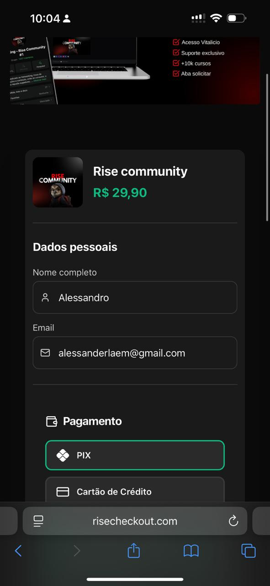
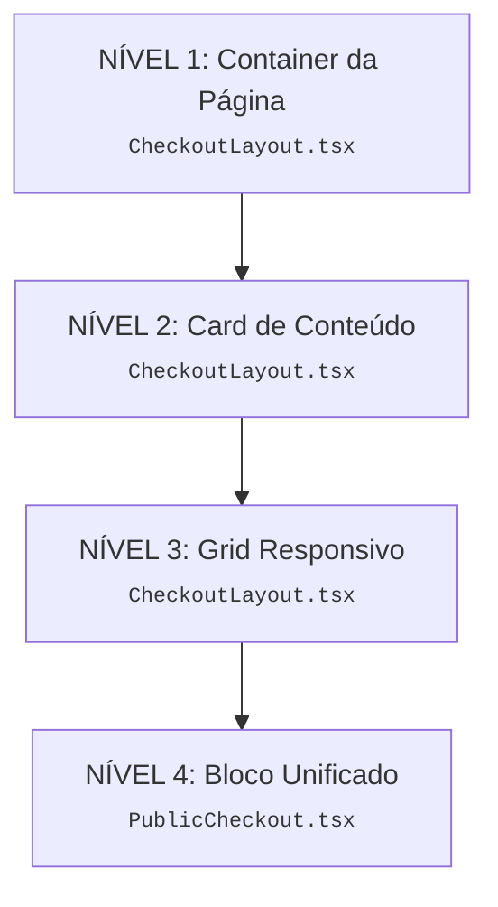
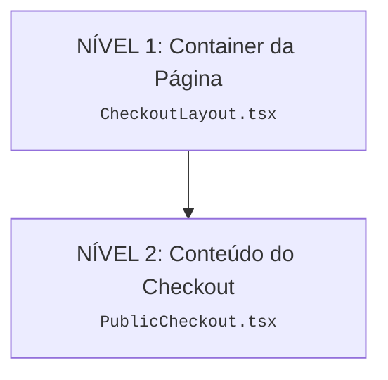

> **Para:** Gemini & Equipe de Desenvolvimento
> **De:** Manus AI
> **Assunto:** Análise e Plano de Refatoração do Layout Mobile do RiseCheckout

## 1. Resumo Executivo

O layout mobile do RiseCheckout está com um problema persistente de largura, parecendo "espremido" e com espaços laterais excessivos, apesar de múltiplas tentativas de correção. A complexidade da estrutura atual, com 4 níveis de componentes aninhados controlando o layout, tornou a manutenção e o debug extremamente difíceis.

Este relatório documenta o problema, o histórico de tentativas de correção e apresenta um plano de refatoração para simplificar a arquitetura, aumentar a manutenibilidade e resolver o problema de largura de forma definitiva, alinhando o design com as referências de mercado (ex: Cakto).

## 2. Problema Detalhado

O layout mobile não ocupa a largura total da tela, resultando em uma experiência de usuário inferior e uma aparência pouco profissional em comparação com concorrentes.

### Análise Visual Comparativa

| RiseCheckout (Atual) | Cakto (Referência) |
| :---: | :---: |
|  |  |

**Observações:**
- **RiseCheckout:** Possui grandes margens laterais, "espremendo" o conteúdo no centro.
- **Cakto:** Utiliza quase 100% da largura da tela, com margens mínimas, proporcionando uma aparência mais robusta e profissional.

## 3. Histórico de Tentativas de Correção

Foram realizados 7 commits na tentativa de resolver o problema, focando em ajustes de `padding` e `maxWidth`.

```bash
# Log de Commits Relevantes
7344ca8 (revertido) - fix: remover padding do card no mobile (solucao rapida)
267372d - fix: forçar maxWidth 100% no mobile
ef0664f - feat: remover padding lateral no mobile (100% largura)
c90a061 - feat: aumentar largura horizontal no mobile
6d691da - fix: corrigir estrutura JSX
a82eec6 - feat: otimizar layout mobile
1d0c29f - feat: implementar melhorias de layout (Fase 1 e 2)
```

Apesar das mudanças, o problema persistiu, indicando que a causa raiz é a complexidade da estrutura e não um simples ajuste de CSS.

## 4. Análise da Estrutura Atual

O problema principal reside na arquitetura de 4 níveis de componentes aninhados, cada um com sua própria lógica de estilo, tornando o resultado final imprevisível.

### Mapeamento da Estrutura de Layout



- **Múltiplos Pontos de Controle:** Estilos de `padding` e `maxWidth` estão espalhados por 2 arquivos e 4 componentes diferentes.
- **Complexidade Desnecessária:** A mesma funcionalidade poderia ser alcançada com uma estrutura de 2 níveis.

## 5. Plano de Refatoração Proposto

O objetivo é substituir a estrutura de 4 níveis por uma de 2 níveis, centralizando o controle do layout em um único componente (`CheckoutLayout.tsx`) e adotando uma abordagem **mobile-first**.

### Nova Estrutura Proposta (2 Níveis)



### Fase 1: Refatorar `CheckoutLayout.tsx`

Simplificar o componente para ser um container simples que aplica o `maxWidth` no desktop e ocupa 100% no mobile.

**Código Proposto para `CheckoutLayout.tsx`:**

```tsx
import { cn } from "@/lib/utils";
import { useCheckoutDevice } from "@/hooks/useCheckoutDevice";

// ... (interfaces)

export const CheckoutLayout = ({ 
  children, 
  backgroundColor,
  className,
  maxWidth = "1100px",
}: CheckoutLayoutProps) => {
  const isMobile = useCheckoutDevice();

  return (
    <div className={cn(
      "min-h-screen w-full flex flex-col items-center py-4 md:py-12",
      isMobile ? "bg-transparent" : "bg-muted/30"
    )}>
      <div 
        className={cn(
          "w-full",
          isMobile 
            ? "rounded-none"
            : "rounded-xl shadow-2xl",
          className
        )}
        style={{ 
          maxWidth: isMobile ? "100%" : maxWidth,
          backgroundColor
        }}
      >
        {children}
      </div>
    </div>
  );
};
```

### Fase 2: Ajustar `PublicCheckout.tsx`

Remover as camadas de `div` redundantes e aplicar o padding diretamente onde for necessário (nos títulos, inputs, etc.), não no container.

**Estrutura a ser removida de `PublicCheckout.tsx`:**

```tsx
// REMOVER ESTAS DUAS CAMADAS
<div className="md:space-y-8">
  <div className="rounded-md md:rounded-xl shadow-sm p-3 md:p-8">
    {/* ... */}
  </div>
</div>
```

### Vantagens da Refatoração

| Aspecto | Antes | Depois |
|---|---|---|
| **Níveis de Aninhamento** | 4 | 2 |
| **Pontos de Controle** | 4 | 1 |
| **Complexidade** | Alta | Baixa |
| **Manutenibilidade** | Difícil | Fácil |

## 6. Próximos Passos

Recomenda-se a implementação deste plano de refatoração para resolver o problema de layout de forma sustentável e preparar o código para futuras evoluções com maior agilidade e menor risco de bugs.
